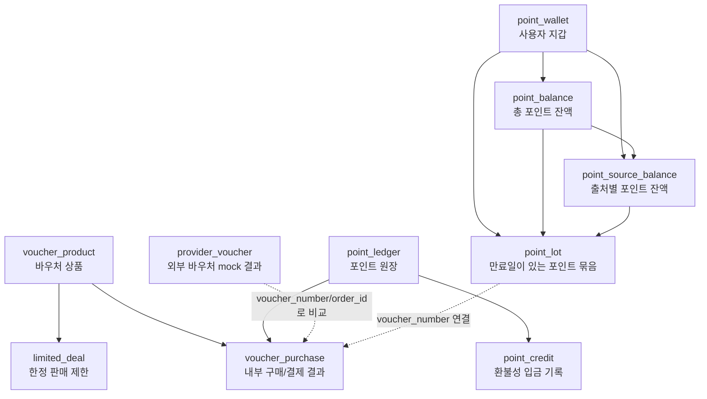
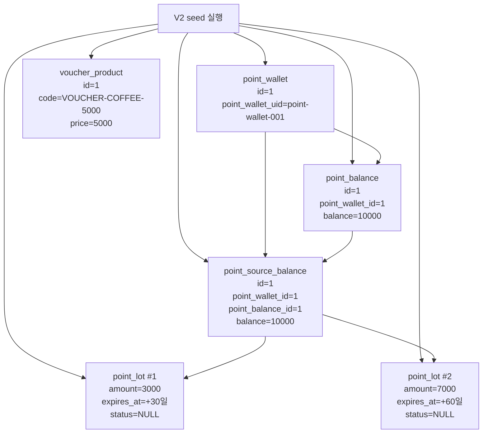
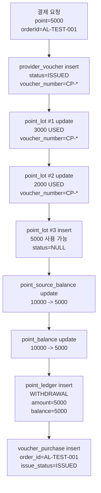
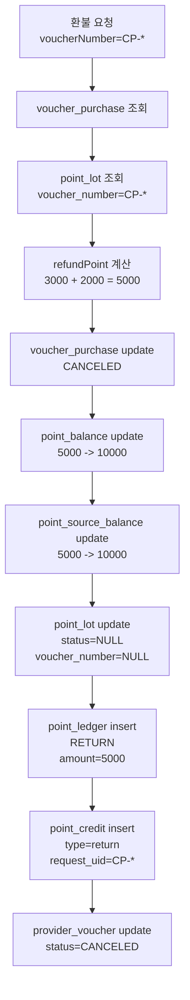

# 상세 데이터 흐름과 테이블 역할 분석

이 문서는 `point-payment-lab`의 테이블 구조를 이해하기 위해 작성했다.

초기 seed 데이터가 왜 필요한지, 결제/환불 시 어떤 값이 어떤 테이블에 insert/update 되는지, 각 테이블을 왜 나누었는지 질문 중심으로 정리한다.

## 1. 먼저 알아둘 것

### seed 데이터란?

seed 데이터는 애플리케이션을 테스트하기 전에 DB에 미리 넣어두는 기본 데이터다.

이 프로젝트에서는 결제/환불 로직을 실행하려면 최소한 다음 데이터가 먼저 있어야 한다.

```text
지갑
상품
총 포인트 잔액
출처별 포인트 잔액
사용 가능한 포인트 묶음
```

그래서 `V2__seed_legacy_payment_data.sql`에서 다음 데이터를 미리 넣는다.

```sql
insert into point_wallet (id, point_wallet_uid)
values (1, 'point-wallet-001');

insert into voucher_product (id, voucher_product_code, voucher_name, sell_price, use_term)
values (1, 'VOUCHER-COFFEE-5000', '커피 5천원권', 5000, 366);

insert into point_balance (id, point_wallet_id, balance)
values (1, 1, '10000');

insert into point_source_balance (id, point_wallet_id, point_balance_id, balance)
values (1, 1, 1, '10000');

insert into point_lot (point_wallet_id, point_source_balance_id, point_balance_id, amount, expires_at, voucher_number, status)
values
    (1, 1, 1, '3000', date_add(now(6), interval 30 day), null, null),
    (1, 1, 1, '7000', date_add(now(6), interval 60 day), null, null);
```

즉 "seed 데이터로 생성"이라는 말은 **결제와 환불 테스트가 가능하도록 필요한 기본 데이터를 미리 등록해둔다**는 뜻이다.

### 왜 id를 bigint로 만들었나?

대부분의 테이블 PK는 `bigint`다.

이유는 보통 다음과 같다.

| 이유 | 설명 |
| --- | --- |
| 많은 row를 저장할 수 있음 | `int`보다 훨씬 큰 범위를 지원한다. 결제/원장/이력 테이블은 row가 계속 늘어날 수 있다. |
| DB 기본 PK 관례 | Spring/JPA/MySQL 조합에서 auto increment PK를 `Long`/`bigint`로 두는 경우가 많다. |
| 외래키 타입 통일 | 여러 테이블이 서로 참조하므로 PK/FK 타입을 `bigint`로 통일하면 매핑이 단순하다. |
| 미래 확장 여지 | 지금은 실습 데이터가 적지만, 실제 결제/포인트 이력은 누적량이 커질 수 있다. |

Java에서는 `bigint`를 보통 `Long`으로 매핑한다.

## 2. PK와 UK 차이

### PK

PK는 Primary Key다. 테이블 안에서 row 하나를 식별하는 대표 키다.

특징:

```text
테이블당 보통 1개
NULL 불가
중복 불가
다른 테이블에서 FK로 참조하기 좋음
```

예:

```text
point_wallet.id
voucher_product.id
point_balance.id
```

### UK

UK는 Unique Key다. 특정 컬럼 값의 중복을 막는 제약이다.

특징:

```text
테이블에 여러 개 둘 수 있음
비즈니스적으로 중복되면 안 되는 값에 사용
PK는 아니지만 중복 저장을 막음
```

예:

```text
point_wallet.point_wallet_uid
voucher_product.voucher_product_code
voucher_purchase.order_id
voucher_purchase.voucher_number
point_credit.request_uid
```

정리하면 다음과 같다.

```text
PK
-> DB 내부에서 row를 식별하는 대표 키

UK
-> 비즈니스적으로 중복되면 안 되는 값을 막는 키
```

## 3. 전체 테이블 관계 그림



## 4. 테이블별 역할과 질문 답변

### 4.1 point_wallet

사용자 포인트 지갑 테이블이다.

컬럼:

| 컬럼 | 역할 |
| --- | --- |
| `id` | DB 내부 PK |
| `point_wallet_uid` | 클라이언트/앱에서 사용하는 지갑 식별자, UK |
| `created_at` | 생성 시각 |

질문: `id`와 `point_wallet_uid`를 왜 따로 만들었나?

`id`는 DB 내부 식별자다. 다른 테이블은 보통 이 값을 FK로 참조한다.

`point_wallet_uid`는 외부에서 지갑을 찾을 때 쓰는 비즈니스 식별자다. 결제 요청의 `pointWalletUid`가 이 값이다.

예:

```json
{
  "pointWalletUid": "point-wallet-001"
}
```

이 요청이 들어오면 서버는 다음처럼 조회한다.

```text
point_wallet.point_wallet_uid = 'point-wallet-001'
```

조회된 row의 `id=1`을 이용해 `point_balance`, `point_lot` 등을 찾는다.

주의:

```text
point_wallet_uid
-> point_wallet 테이블 안의 외부 지갑 식별자

point_wallet_id
-> 다른 테이블에서 point_wallet.id를 참조하는 FK
```

즉 `point_wallet_id`는 `point_wallet_uid`를 참조하는 것이 아니라 `point_wallet.id`를 참조한다.

### 4.2 voucher_product

구매 가능한 바우처 상품 테이블이다.

컬럼:

| 컬럼 | 역할 |
| --- | --- |
| `id` | DB 내부 PK |
| `voucher_product_code` | 외부 바우처 제공사에 전달할 상품 코드, UK |
| `voucher_name` | 상품명 |
| `sell_price` | 판매 가격 |
| `use_term` | 바우처 유효기간 일수 |

결제 전에 상품이 반드시 있어야 한다.

이유:

```text
결제 요청의 voucherProductId로 voucher_product 조회
-> voucher_product_code를 외부 바우처 발행 API에 전달
-> use_term으로 valid_until 계산
```

현재는 seed 데이터로 기본 상품 1개가 들어가고, 추가 상품은 다음 API로 등록할 수 있다.

```http
POST /api/admin/voucher-products
```

### 4.3 limited_deal

한정 판매 제한 정보 테이블이다.

컬럼:

| 컬럼 | 역할 |
| --- | --- |
| `id` | DB 내부 PK |
| `voucher_product_id` | 제한 대상 상품 |
| `total_purchase_limit` | 전체 구매 가능 수량 |
| `individual_purchase_limit` | 사용자별 구매 가능 수량 |

질문: 언제 사용되는가?

현재 legacy 결제 로직에서는 직접 사용하지 않는다.

원래는 다음 같은 정책 검증에 쓰일 수 있다.

```text
전체 판매 수량이 남았는지
한 사람이 같은 상품을 너무 많이 구매하지 않았는지
품절 상품인지
```

즉 지금은 구조만 있는 테이블이고, 실제 구매 제한 검증은 아직 구현되지 않았다.

### 4.4 point_balance

지갑 기준 총 포인트 잔액 테이블이다.

컬럼:

| 컬럼 | 역할 |
| --- | --- |
| `id` | DB 내부 PK |
| `point_wallet_id` | `point_wallet.id` 참조 |
| `balance` | 총 포인트 잔액 |

질문: 왜 잔고 테이블을 따로 만들었나?

`point_wallet`은 지갑 식별 정보를 담고, `point_balance`는 포인트 잔액을 담는다.

둘을 나누는 이유는 역할이 다르기 때문이다.

```text
point_wallet
-> 사용자의 지갑 자체

point_balance
-> 그 지갑에 연결된 포인트 잔액
```

실제 서비스에서는 한 지갑이 여러 종류의 잔액을 가질 수 있다.

예:

```text
일반 포인트
이벤트 포인트
제휴사 포인트
토큰별 잔액
```

이 실습에서는 단순화를 위해 지갑 1개에 총 잔액 1개만 seed로 넣었다.

결제 시:

```text
balance = 기존 balance - 결제 point
```

환불 시:

```text
balance = 기존 balance + 환불 point
```

### 4.5 point_source_balance

포인트 출처별 잔액 테이블이다.

컬럼:

| 컬럼 | 역할 |
| --- | --- |
| `id` | DB 내부 PK |
| `point_wallet_id` | `point_wallet.id` 참조 |
| `point_balance_id` | `point_balance.id` 참조 |
| `balance` | 특정 출처 기준 잔액 |

질문: `point_balance`가 있는데 왜 또 만들었나?

`point_balance`는 총 잔액이고, `point_source_balance`는 출처별 잔액이다.

예:

```text
총 잔액: 10,000

출처별 잔액:
- 이벤트 지급분 3,000
- 구매 적립분 7,000
```

이 실습 seed에서는 출처가 하나라서 `point_balance=10000`, `point_source_balance=10000`으로 같다.

하지만 구조적으로는 하나의 지갑/총 잔액 아래에 여러 출처별 잔액이 있을 수 있다.

결제 시 사용된 `point_lot`의 `point_source_balance_id`를 보고 해당 출처 잔액도 같이 차감한다.

환불 시에는 같은 출처 잔액을 복구한다.

### 4.6 point_lot

만료일이 있는 포인트 묶음 테이블이다.

컬럼:

| 컬럼 | 역할 |
| --- | --- |
| `id` | DB 내부 PK |
| `point_wallet_id` | `point_wallet.id` 참조 |
| `point_source_balance_id` | 어떤 출처의 포인트인지 |
| `point_balance_id` | 어떤 총 잔액에 속하는지 |
| `amount` | 이 포인트 묶음의 수량 |
| `expires_at` | 만료일 |
| `voucher_number` | 결제에 사용되었을 때 연결되는 바우처 번호 |
| `status` | 사용 상태. 사용 가능하면 `NULL`, 사용 완료면 `USED` |

질문: `amount`는 왜 있나?

포인트는 한 번에 10,000이 생겼더라도 만료일이나 출처가 다를 수 있다.

예:

```text
3,000 포인트: 30일 뒤 만료
7,000 포인트: 60일 뒤 만료
```

그래서 `point_lot`은 포인트를 만료일/출처 단위로 쪼개서 관리한다.

결제할 때는 만료일이 빠른 포인트부터 사용한다.

질문: 포인트와 바우처 연결용인가?

일부 맞다.

`point_lot`은 원래 포인트 묶음을 관리하기 위한 테이블이고, 결제 후에는 어떤 바우처 구매에 사용되었는지 추적하기 위해 `voucher_number`를 저장한다.

결제 시:

```text
status = USED
voucher_number = 발급된 바우처 번호
```

환불 시:

```text
status = NULL
voucher_number = NULL
```

### 4.7 point_ledger

포인트 사용/환불 원장 테이블이다.

컬럼:

| 컬럼 | 역할 |
| --- | --- |
| `id` | DB 내부 PK |
| `point_wallet_id` | 지갑 ID |
| `point_balance_id` | 잔액 ID |
| `state` | 이력 상태 |
| `amount` | 변동된 포인트 수량 |
| `balance` | 변동 후 잔액 |
| `title` | 이력 표시 문구 |
| `occurred_at` | 발생 시각 |

질문: 포인트를 사용하고 환불했을 때의 이력을 남기는 용도인가?

맞다.

결제 시:

```text
state = WITHDRAWAL
amount = 사용 포인트
balance = 결제 후 잔액
title = 포인트 바우처 구매
```

환불 시:

```text
state = RETURN
amount = 환불 포인트
balance = 환불 후 잔액
title = 포인트 바우처 환불
```

즉 `point_balance`가 현재 잔액이라면, `point_ledger`는 잔액이 왜 바뀌었는지 남기는 이력 테이블이다.

### 4.8 point_credit

환불성 포인트 입금 기록 테이블이다.

컬럼:

| 컬럼 | 역할 |
| --- | --- |
| `id` | DB 내부 PK |
| `type` | 입금 유형 |
| `request_uid` | 입금 요청 식별자 |
| `value` | 입금 포인트 수량 |
| `point_ledger_id` | 연결된 원장 이력 |

질문: 왜 따로 만들었나?

`point_ledger`는 전체 포인트 변동 이력이고, `point_credit`은 그중 "입금성 이벤트"를 따로 기록하는 테이블이다.

환불 시 생성된다.

```java
PointCredit.returned(
    withdrawal.getVoucherNumber(),
    refundPoint,
    returnHistory.getId()
)
```

그래서 값은 다음처럼 들어간다.

| 컬럼 | 환불 시 값 |
| --- | --- |
| `type` | `return` |
| `request_uid` | 환불 대상 `voucher_number` |
| `value` | 환불 포인트 |
| `point_ledger_id` | 새로 생성된 `RETURN` 원장 ID |

`request_uid`에 unique 제약이 있으므로, 같은 바우처 번호로 입금 기록이 중복 생성되는 것을 막는 데 활용할 수 있다.

다만 현재 구현은 환불 시작 전에 `point_credit` 존재 여부를 먼저 검사하지는 않는다. 그래서 이 테이블은 "기록과 제약은 있지만, 환불 멱등성 로직은 아직 부족한 상태"다.

### 4.9 voucher_purchase

내부 바우처 구매/결제 결과 테이블이다.

컬럼:

| 컬럼 | 역할 |
| --- | --- |
| `id` | DB 내부 PK |
| `voucher_number` | 외부 제공사가 발급한 바우처 번호, UK |
| `pin_number` | 외부 제공사가 발급한 핀 번호 |
| `order_id` | 내부 주문/거래 ID, UK |
| `voucher_product_id` | 구매한 상품 ID |
| `point_ledger_id` | 결제 사용 원장 ID |
| `payment_type` | 결제 방식 |
| `point_amount` | 사용 포인트 |
| `card_amount` | 카드 결제 금액. 현재는 0 |
| `payment_method` | 표시용 결제 수단 |
| `issue_status` | 발급 상태 |
| `use_status` | 사용 상태 |
| `valid_from` | 바우처 유효 시작 시각 |
| `valid_until` | 바우처 유효 종료 시각 |
| `used_or_canceled_at` | 사용/취소 시각 |

질문: 여기에 `point_ledger_id`를 왜 갖고 있나?

이 구매 이력이 어떤 포인트 사용 이력과 연결되는지 추적하기 위해서다.

```text
voucher_purchase
-> 이 바우처 구매 결과

point_ledger
-> 이 구매 때문에 발생한 포인트 사용 이력
```

질문: `order_id`는 바우처를 사용했을 때 발행되는 값인가?

아니다.

`order_id`는 바우처 사용 시점이 아니라 **결제 요청 시점에 클라이언트/서버가 가진 내부 거래 식별자**다.

예:

```json
{
  "orderId": "AL-TEST-001"
}
```

이 값이 `voucher_purchase.order_id`에 저장된다.

`order_id`는 unique라서 같은 주문 ID가 내부 결제 이력에 중복 저장되는 것을 막는다.

질문: `issue_status`는 발행 실패도 있어서 갖고 있나?

의도는 맞다.

현재 구현은 외부 발행 성공 후에만 `voucher_purchase`를 insert하므로 기본값이 `ISSUED`다.

환불하면:

```text
issue_status = CANCELED
use_status = CANCELED
used_or_canceled_at = 환불 시각
```

나중에 개선하면 `FAILED`, `PENDING` 같은 상태를 추가해 발행 실패/처리 중 상태도 표현할 수 있다.

### 4.10 provider_voucher

외부 바우처 제공사 mock 결과 테이블이다.

컬럼:

| 컬럼 | 역할 |
| --- | --- |
| `id` | DB 내부 PK |
| `voucher_product_code` | 발행 요청으로 전달받은 외부 상품 코드 |
| `voucher_number` | mock 외부 API가 생성한 바우처 번호 |
| `pin_number` | mock 외부 API가 생성한 핀 번호 |
| `order_id` | 발행 요청의 거래 ID |
| `status` | 외부 바우처 상태 |

질문: `voucher_product_code`는 참조용으로만 쓰나?

현재 DB FK는 없다. 즉 `voucher_product.id`를 직접 참조하지 않는다.

외부 API에 전달하는 상품 코드로 저장해두는 값이다.

```text
내부 상품 PK: voucher_product.id
외부 제공사 상품 코드: voucher_product.voucher_product_code
```

실제 외부 API는 보통 내부 DB의 PK를 모르고, 약속된 상품 코드만 이해한다.

질문: `voucher_number`, `pin_number`는 여기서 만드나?

현재 mock 구현에서는 맞다.

`MockVoucherProviderController.issue()`에서 UUID로 만든다.

```text
voucher_number = CP-{UUID}
pin_number = PIN-{UUID 앞 8자리}
```

그리고 `provider_voucher`에 먼저 저장한 뒤, 결제 서비스로 응답한다.

실제 서비스라면 이 값은 외부 바우처 제공사가 응답으로 내려주는 값이다.

## 5. seed 데이터 기준 초기 상태



초기 상태에서 결제 가능 포인트는 다음과 같다.

```text
point_balance.balance = 10000
사용 가능한 point_lot 합계 = 3000 + 7000 = 10000
```

## 6. 정상 결제 데이터 흐름

요청 예:

```json
{
  "orderId": "AL-TEST-001",
  "pointWalletUid": "point-wallet-001",
  "voucherProductId": 1,
  "pointBalanceId": 1,
  "point": 5000
}
```

### 6.1 외부 바우처 발행

먼저 `voucher_product.id=1`을 조회한다.

```text
voucher_product_code = VOUCHER-COFFEE-5000
use_term = 366
```

외부 바우처 발행 mock API가 호출되면 `provider_voucher`에 insert 된다.

```text
provider_voucher insert
- voucher_product_code = VOUCHER-COFFEE-5000
- voucher_number = CP-{UUID}
- pin_number = PIN-{UUID}
- order_id = AL-TEST-001
- status = ISSUED
```

이 시점은 내부 DB transaction보다 앞이다.

### 6.2 내부 결제 transaction

그 다음 `transactionTemplate.execute()` 안에서 내부 DB 변경이 실행된다.

초기 `point_lot`:

| lot | amount | expires_at | status |
| --- | --- | --- | --- |
| lot #1 | 3000 | +30일 | `NULL` |
| lot #2 | 7000 | +60일 | `NULL` |

결제 요청 포인트는 5000이다.

만료일 빠른 순으로 사용하므로 lot #1의 3000을 먼저 사용한다.

```text
lot #1 update
- amount = 3000
- status = USED
- voucher_number = CP-{UUID}
```

남은 결제 필요 포인트는 2000이다.

lot #2는 7000이 있으므로 그중 2000만 사용한다.

```text
lot #2 update
- amount = 2000
- status = USED
- voucher_number = CP-{UUID}
```

lot #2의 남은 5000은 새 lot으로 insert 된다.

```text
point_lot insert
- amount = 5000
- expires_at = lot #2와 동일
- status = NULL
- voucher_number = NULL
```

출처별 잔액도 차감된다.

```text
point_source_balance update
- 기존 balance = 10000
- lot #1 사용 후 7000
- lot #2 사용 후 5000
```

총 잔액도 차감된다.

```text
point_balance update
- 기존 balance = 10000
- 결제 후 balance = 5000
```

포인트 사용 원장이 생성된다.

```text
point_ledger insert
- point_wallet_id = 1
- point_balance_id = 1
- state = WITHDRAWAL
- amount = 5000
- balance = 5000
- title = 포인트 바우처 구매
```

구매 이력이 생성된다.

```text
voucher_purchase insert
- voucher_number = CP-{UUID}
- pin_number = PIN-{UUID}
- order_id = AL-TEST-001
- voucher_product_id = 1
- point_ledger_id = 새로 생성된 WITHDRAWAL ledger id
- payment_type = POINT
- point_amount = 5000
- card_amount = 0
- payment_method = 전액 포인트
- issue_status = ISSUED
- use_status = UNUSED
- valid_from = 현재 시각
- valid_until = 현재 시각 + 366일
```

### 6.3 결제 후 상태 그림



## 7. 환불 데이터 흐름

환불 요청:

```json
{
  "voucherNumber": "CP-{UUID}"
}
```

### 7.1 환불 대상 조회

먼저 `voucher_purchase.voucher_number`로 구매 이력을 찾는다.

```text
voucher_purchase 조회
- voucher_number = CP-{UUID}
```

그리고 결제 당시 사용 원장도 찾는다.

```text
point_ledger 조회
- id = voucher_purchase.point_ledger_id
```

이후 이 바우처 번호가 연결된 `point_lot`을 찾는다.

```text
point_lot 조회
- voucher_number = CP-{UUID}
```

예상되는 used lot:

| lot | amount | status | voucher_number |
| --- | --- | --- | --- |
| lot #1 | 3000 | USED | CP-* |
| lot #2 | 2000 | USED | CP-* |

환불 포인트는 stream으로 합산한다.

```text
refundPoint = 3000 + 2000 = 5000
```

### 7.2 내부 환불 transaction

구매 이력을 취소 상태로 바꾼다.

```text
voucher_purchase update
- issue_status = CANCELED
- use_status = CANCELED
- used_or_canceled_at = 현재 시각
```

총 잔액을 복구한다.

```text
point_balance update
- 기존 balance = 5000
- 환불 후 balance = 10000
```

출처별 잔액을 복구한다.

```text
point_source_balance update
- 기존 balance = 5000
- lot #1 복구 후 8000
- lot #2 복구 후 10000
```

사용되었던 포인트 묶음을 다시 사용 가능 상태로 만든다.

```text
point_lot #1 update
- status = NULL
- voucher_number = NULL

point_lot #2 update
- status = NULL
- voucher_number = NULL
```

주의:

```text
결제 시 split되어 새로 만들어진 5000짜리 lot은 그대로 남아 있다.
환불 시 lot #1, lot #2만 복구된다.
```

포인트 환불 원장을 생성한다.

```text
point_ledger insert
- state = RETURN
- amount = 5000
- balance = 10000
- title = 포인트 바우처 환불
```

환불성 입금 기록을 생성한다.

```text
point_credit insert
- type = return
- request_uid = CP-{UUID}
- value = 5000
- point_ledger_id = 새로 생성된 RETURN ledger id
```

### 7.3 외부 바우처 취소

내부 DB 환불 transaction이 끝난 뒤 외부 바우처 취소 API를 호출한다.

```text
provider_voucher update
- status = CANCELED
```

현재 환불 로직은 내부 DB 환불을 먼저 끝내고 외부 취소를 나중에 한다.

그래서 외부 취소 API가 실패하면 다음 불일치가 생길 수 있다.

```text
내부 DB = 환불 완료
외부 바우처 = 아직 ISSUED
```

### 7.4 환불 후 상태 그림



## 8. 결제/환불 전체 값 변화 표

| 단계 | 테이블 | 작업 | 주요 값 |
| --- | --- | --- | --- |
| seed | `point_wallet` | insert | `id=1`, `point_wallet_uid=point-wallet-001` |
| seed | `voucher_product` | insert | `id=1`, `code=VOUCHER-COFFEE-5000`, `price=5000` |
| seed | `point_balance` | insert | `id=1`, `balance=10000` |
| seed | `point_source_balance` | insert | `id=1`, `balance=10000` |
| seed | `point_lot` | insert | `3000`, `7000`, 둘 다 사용 가능 |
| 결제 | `provider_voucher` | insert | `voucher_number=CP-*`, `pin_number=PIN-*`, `status=ISSUED` |
| 결제 | `point_lot` | update | 사용된 lot `status=USED`, `voucher_number=CP-*` |
| 결제 | `point_lot` | insert | 일부 사용 후 남은 포인트 lot |
| 결제 | `point_source_balance` | update | `10000 -> 5000` |
| 결제 | `point_balance` | update | `10000 -> 5000` |
| 결제 | `point_ledger` | insert | `state=WITHDRAWAL`, `amount=5000`, `balance=5000` |
| 결제 | `voucher_purchase` | insert | `order_id=AL-TEST-001`, `point_amount=5000`, `issue_status=ISSUED` |
| 환불 | `voucher_purchase` | update | `issue_status=CANCELED`, `use_status=CANCELED` |
| 환불 | `point_balance` | update | `5000 -> 10000` |
| 환불 | `point_source_balance` | update | `5000 -> 10000` |
| 환불 | `point_lot` | update | `status=NULL`, `voucher_number=NULL` |
| 환불 | `point_ledger` | insert | `state=RETURN`, `amount=5000`, `balance=10000` |
| 환불 | `point_credit` | insert | `type=return`, `request_uid=CP-*`, `value=5000` |
| 환불 | `provider_voucher` | update | `status=CANCELED` |

## 9. 현재 구조에서 헷갈릴 수 있는 점

### point_wallet_uid와 point_wallet_id

```text
point_wallet_uid
-> 지갑 테이블 안의 외부 식별자
-> 예: point-wallet-001

point_wallet_id
-> 다른 테이블에서 point_wallet.id를 참조하는 FK
-> 예: 1
```

### point_balance와 point_source_balance

```text
point_balance
-> 총 잔액

point_source_balance
-> 출처별 잔액
```

현재 seed에서는 둘 다 10000이라 같은 값처럼 보이지만, 실제 의도는 다르다.

### point_lot과 balance

```text
point_balance.balance
-> 현재 총액

point_lot
-> 만료일/출처별로 쪼개진 실제 사용 단위
```

결제할 때는 총 잔액만 차감하는 것이 아니라, 실제 어떤 포인트 묶음이 사용되었는지도 `point_lot`에 남긴다.

### voucher_purchase와 provider_voucher

```text
provider_voucher
-> 외부 바우처 제공사 mock의 발행 결과

voucher_purchase
-> 우리 내부 결제/구매 결과
```

현재 실습에서는 둘 다 같은 DB에 있지만, 개념적으로는 외부 시스템과 내부 시스템을 구분하기 위해 나누었다.

## 10. 앞으로 개선할 때 볼 부분

현재 구조에서 개선할 수 있는 지점:

```text
1. 외부 바우처 발행 전에 잔액, 사용 가능한 point_lot 합계, 상품 가격을 검증
2. 잔액 부족 요청은 외부 발행 API를 호출하거나 provider_voucher를 생성하지 않도록 차단
3. 외부 바우처 발행 전에 orderId 선점
4. PaymentAttempt 테이블 추가
5. 동일 지갑 동시 결제를 row lock 또는 조건부 차감으로 제어
6. 환불 중복 요청 방지
7. point_credit.request_uid를 환불 멱등성 체크에 활용
8. limited_deal을 실제 구매 제한 검증에 연결
9. pointBalanceId를 클라이언트가 넘기지 않고 서버가 지갑 기준으로 찾도록 개선
10. 외부 취소 API 실패 시 retry/outbox 테이블에 기록
```

특히 잔액 검증은 외부 바우처 발행 이후의 DB transaction 안에서만 수행하면 늦다.
검증 가능한 실패는 외부 시스템을 호출하기 전에 차단해야 하며, 동시 요청으로 검증 결과가 무효화되지 않도록 잔액 차감 시점의 동시성 제어도 필요하다.
