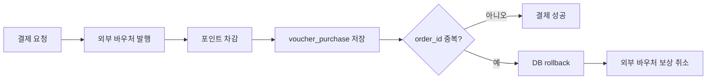
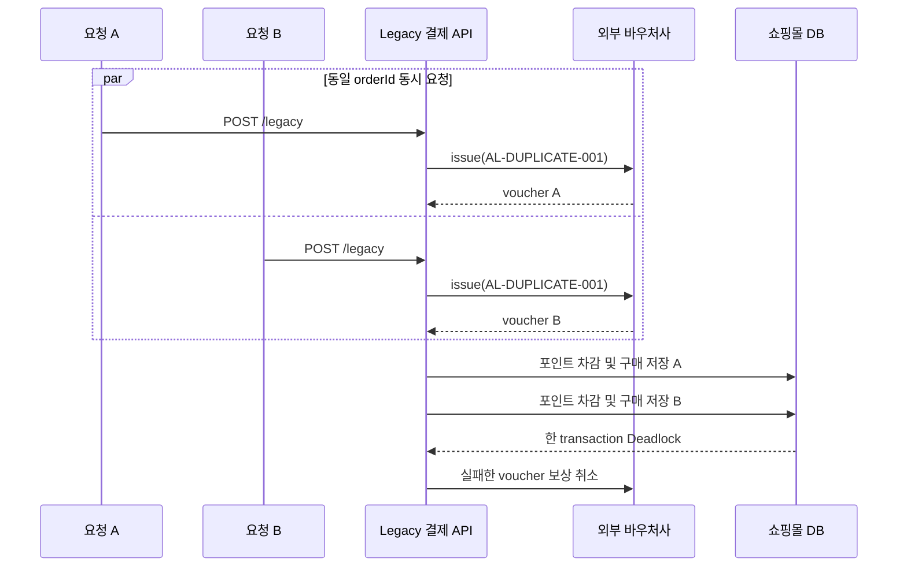
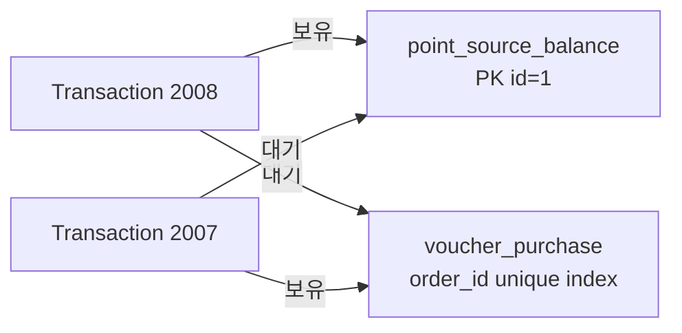
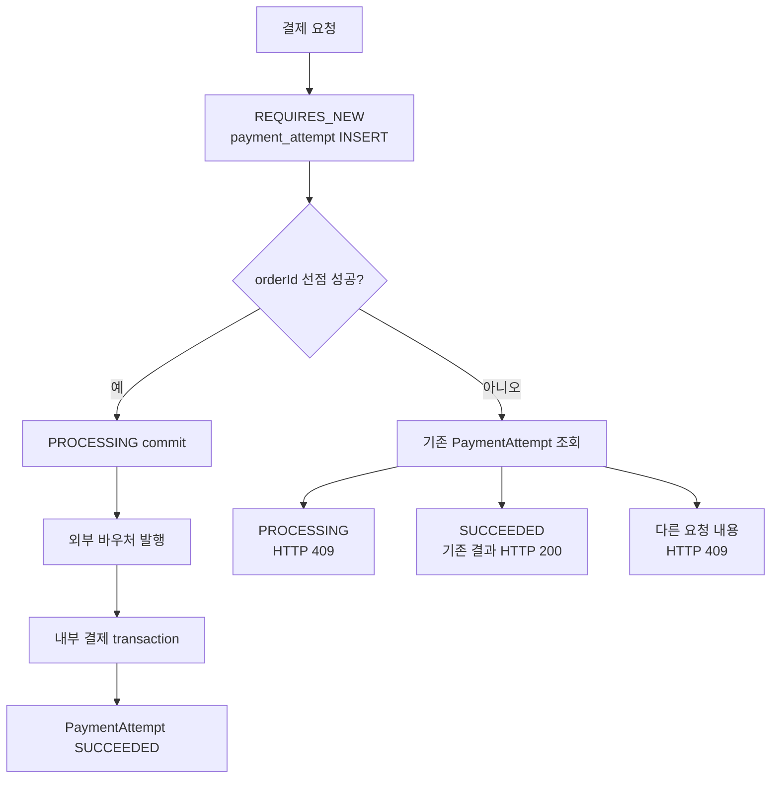
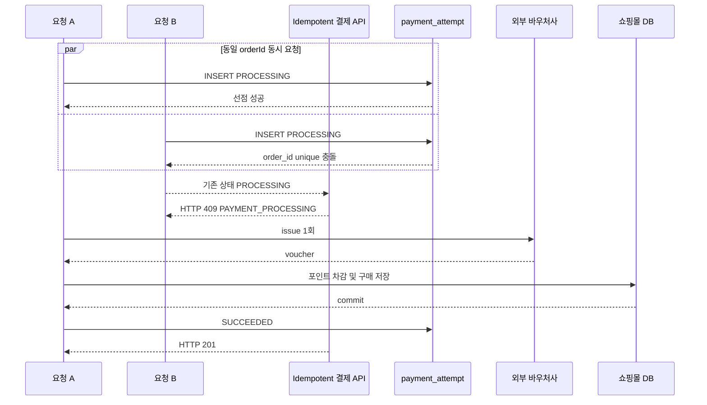
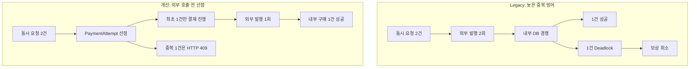

# PaymentAttempt 기반 결제 멱등성 개선 결과

## 1. 문서 목적

이 문서는 동일한 `orderId`의 결제 요청이 동시에 들어왔을 때 발생한 외부 바우처 중복 발행과 DB Deadlock을 재현하고, `PaymentAttempt`를 이용해 개선한 과정을 포트폴리오용으로 정리한다.

비교 대상:

| 구분 | API |
| --- | --- |
| Legacy | `POST /api/payments/point/legacy` |
| 개선 | `POST /api/payments/point/idempotent` |

핵심 결과:

```text
외부 바우처 발행 2회 -> 1회
DB Deadlock 1건 -> 0건
보상 취소 1회 -> 0회
중복 요청 HTTP 500 -> HTTP 409 PAYMENT_PROCESSING
```

## 2. 문제 상황

Legacy 결제는 외부 바우처를 먼저 발행한 뒤 내부 DB transaction을 실행한다.



`voucher_purchase.order_id`에 unique 제약이 있지만, 이 제약은 외부 API가 이미 호출된 뒤에 동작한다. 따라서 내부 구매 데이터의 중복은 막더라도 외부 바우처의 중복 발행은 막지 못한다.

## 3. Legacy 동시 요청 재현

실험 요청:

```text
orderId: AL-DUPLICATE-001
동시 요청: 2건
요청 포인트: 각 5,000
```

실행:

```bash
bash scripts/run-duplicate-payment-test.sh AL-DUPLICATE-001
```

### 3.1 실제 요청 흐름



### 3.2 실제 결과

HTTP 결과:

| 요청 | 상태 | 결과 |
| --- | ---: | --- |
| A | `500` | `Deadlock found when trying to get lock` |
| B | `201` | 바우처 발행 및 결제 성공 |

DB 결과:

| 테이블 | 결과 |
| --- | --- |
| `provider_voucher` | 동일 `order_id` 2건: `ISSUED` 1건, `CANCELED` 1건 |
| `voucher_purchase` | 성공한 구매 1건 |
| `point_ledger` | `WITHDRAWAL` 1건 |
| `point_balance` | 10,000에서 5,000으로 1회 차감 |
| `point_lot` | 성공 바우처에 5,000 포인트만 연결 |

### 3.3 Deadlock 원인

MySQL `SHOW ENGINE INNODB STATUS`에서 두 트랜잭션이 서로 상대방의 락을 기다리는 순환 대기가 확인됐다.



```text
T2008: point_source_balance lock 보유 -> order_id unique lock 대기
T2007: order_id unique lock 보유 -> point_source_balance lock 대기
```

MySQL은 순환 대기를 해소하기 위해 한 transaction을 victim으로 선택해 rollback했다. 내부 데이터는 한 건으로 수습됐지만 외부 발행과 보상 취소는 이미 발생한 뒤였다.

## 4. 개선 목표

외부 API 호출 전에 동일 `orderId`를 선점해 최초 요청만 결제를 진행하도록 한다.

완료 목표:

| 항목 | Legacy | 개선 목표 |
| --- | ---: | ---: |
| 동시 요청 | 2 | 2 |
| 외부 바우처 발행 | 2 | 1 |
| 내부 구매 | 1 | 1 |
| Deadlock | 1 | 0 |
| 보상 취소 | 1 | 0 |

## 5. 개선 설계

### 5.1 PaymentAttempt

Flyway V4에서 `payment_attempt` 테이블을 추가했다.

주요 데이터:

| 컬럼 | 역할 |
| --- | --- |
| `order_id` | 결제 멱등성 키, unique |
| `status` | `PROCESSING`, `SUCCEEDED`, `FAILED` |
| 요청 필드 | 같은 `orderId`가 동일한 결제 요청인지 비교 |
| 바우처 결과 | 완료된 요청의 결과 재사용 |
| `failure_message` | 실패 원인 추적 |

### 5.2 짧은 선점 transaction

`PaymentAttemptWriter.claim()`은 `REQUIRES_NEW` transaction으로 실행한다.



외부 API를 호출하는 긴 작업과 `orderId` 선점 transaction을 분리했다. 선점 결과가 먼저 commit되므로 동시 요청은 외부 발행 단계에 진입하기 전에 기존 처리 상태를 확인할 수 있다.

### 5.3 요청 상태별 응답

| 기존 상태 | 동작 |
| --- | --- |
| 없음 | `PROCESSING`으로 선점하고 결제 진행 |
| `PROCESSING` | `409 PAYMENT_PROCESSING` |
| `SUCCEEDED` | 저장된 기존 결과를 `200`으로 반환 |
| `FAILED` | `409 PAYMENT_FAILED`, 재시도 정책 필요 |
| 같은 `orderId`, 다른 payload | `409 IDEMPOTENCY_KEY_REUSED` |

## 6. 개선 후 동시 요청 검증

실험 요청:

```text
orderId: AL-IDEMPOTENT-VERIFY-001
동시 요청: 2건
요청 포인트: 각 5,000
```

실행:

```bash
bash scripts/run-idempotent-payment-test.sh AL-IDEMPOTENT-VERIFY-001
```

### 6.1 실제 요청 흐름



### 6.2 실제 HTTP 결과

| 요청 | 상태 | 결과 |
| --- | ---: | --- |
| A | `201` | 바우처 발행 및 결제 성공 |
| B | `409` | `PAYMENT_PROCESSING` |

성공 응답:

```json
{
  "message": "A voucher has been issued successfully",
  "orderId": "AL-IDEMPOTENT-VERIFY-001",
  "voucherNumber": "CP-3995487d-0929-45ba-a182-30f1c87c33c6",
  "pinNumber": "PIN-c0f5c39e",
  "pointAmount": 5000,
  "balanceAfterPayment": "0"
}
```

중복 요청 응답:

```json
{
  "message": "payment with this orderId is already processing",
  "status": 409,
  "code": "PAYMENT_PROCESSING"
}
```

### 6.3 실제 DB 결과

| 테이블 | 실제 결과 |
| --- | --- |
| `payment_attempt` | 동일 `order_id` 1건, `SUCCEEDED` |
| `provider_voucher` | 동일 `order_id` 1건, `ISSUED` |
| `voucher_purchase` | 동일 `order_id` 1건, `ISSUED / UNUSED` |
| `point_balance` | 5,000 포인트가 한 번만 차감되어 0 |

`payment_attempt`에 저장된 결과:

```text
order_id: AL-IDEMPOTENT-VERIFY-001
status: SUCCEEDED
voucher_number: CP-3995487d-0929-45ba-a182-30f1c87c33c6
point_amount: 5000
balance_after_payment: 0
```

## 7. 개선 전후 비교

### 7.1 정량 비교

| 지표 | Legacy | 개선 후 | 변화 |
| --- | ---: | ---: | --- |
| 동일 주문 동시 요청 | 2 | 2 | 동일 조건 |
| 외부 바우처 발행 | 2 | 1 | 중복 발행 제거 |
| 내부 구매 성공 | 1 | 1 | 정상 결과 유지 |
| Deadlock | 1 | 0 | 제거 |
| 보상 취소 | 1 | 0 | 불필요한 외부 호출 제거 |
| 중복 요청 응답 | `500` | `409` | 예측 가능한 비즈니스 응답 |

### 7.2 구조 비교



## 8. 구현 효과

### 외부 시스템 부하 감소

동일 주문의 외부 발행 호출이 2회에서 1회로 줄었다. 실패한 중복 발행을 취소하기 위한 보상 API도 호출되지 않는다.

### 장애 대신 상태 기반 응답

중복 요청이 DB 깊숙한 곳까지 진입해 Deadlock과 `HTTP 500`을 만드는 대신, API 입구에서 처리 상태를 확인하고 `HTTP 409 PAYMENT_PROCESSING`을 반환한다.

### 완료 결과 재사용 기반 마련

`PaymentAttempt`에 성공한 바우처 번호, PIN, 결제 포인트, 결제 후 잔액을 저장한다. 완료된 동일 요청은 외부 API와 포인트 차감을 다시 실행하지 않고 기존 결과를 반환할 수 있다.

### 문제 추적성 향상

기존에는 실패한 요청이 `voucher_purchase` rollback으로 사라졌다. 개선 후에는 요청 상태가 `payment_attempt`에 남아 처리 중·성공·실패를 조회할 수 있다.

## 9. 검증 자료

Legacy 증거:

- `evidence/duplicate-payment-legacy/response-a.txt`
- `evidence/duplicate-payment-legacy/response-b.txt`
- `evidence/duplicate-payment-legacy/db-after.txt`

자동화 및 테스트:

- `scripts/run-duplicate-payment-test.sh`
- `scripts/run-idempotent-payment-test.sh`
- `src/test/java/com/paymentlab/voucher/payment/application/IdempotentPointPaymentServiceTest.java`

단위 테스트 검증 항목:

- 최초 요청의 선점과 결제 진행
- 완료된 요청의 저장 결과 재사용
- 처리 중 동시 요청 차단
- 같은 `orderId`의 다른 payload 차단
- 결제 실패 상태 기록

## 10. 남은 한계와 다음 개선

이번 개선은 동일한 `orderId`의 중복 요청을 막는다. 다음 문제는 별도 단계에서 개선한다.

1. 외부 바우처 발행사도 `orderId` 기준 멱등성을 보장하도록 이중 방어
2. 잔액 부족 요청을 외부 API 호출 전에 차단
3. 서로 다른 `orderId`가 같은 지갑 잔액을 동시에 사용하는 문제
4. 외부 보상 취소 실패 기록과 재시도
5. 장시간 `PROCESSING` 상태의 timeout 및 reconciliation

## 11. 포트폴리오 요약

> 기존 포인트 결제는 외부 바우처 발행 이후 내부 DB의 `order_id` unique 제약으로 중복을 방어했습니다. 동일 주문의 동시 요청을 재현한 결과 외부 바우처가 2장 발행되고 내부 transaction에서 Deadlock이 발생했으며, 한 바우처를 보상 취소해야 했습니다.
>
> 이를 개선하기 위해 외부 API 호출 전에 `PaymentAttempt`를 별도 transaction으로 생성해 `orderId`를 선점했습니다. 최초 요청만 외부 발행과 포인트 차감에 진입하고, 동시 중복 요청은 `409 PAYMENT_PROCESSING`으로 차단했습니다.
>
> 동일 조건을 다시 검증한 결과 외부 발행은 2회에서 1회, Deadlock은 1건에서 0건, 보상 취소는 1회에서 0회로 감소했습니다. 내부 구매 성공 1건은 그대로 유지하면서 중복 요청을 예측 가능한 상태 기반 응답으로 전환했습니다.
