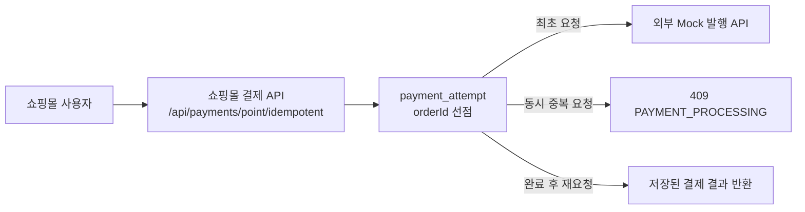
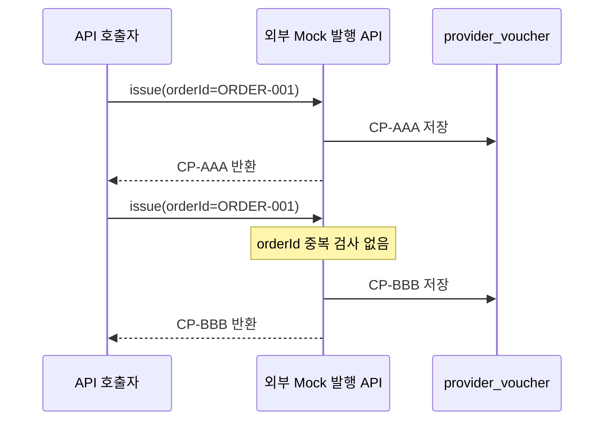
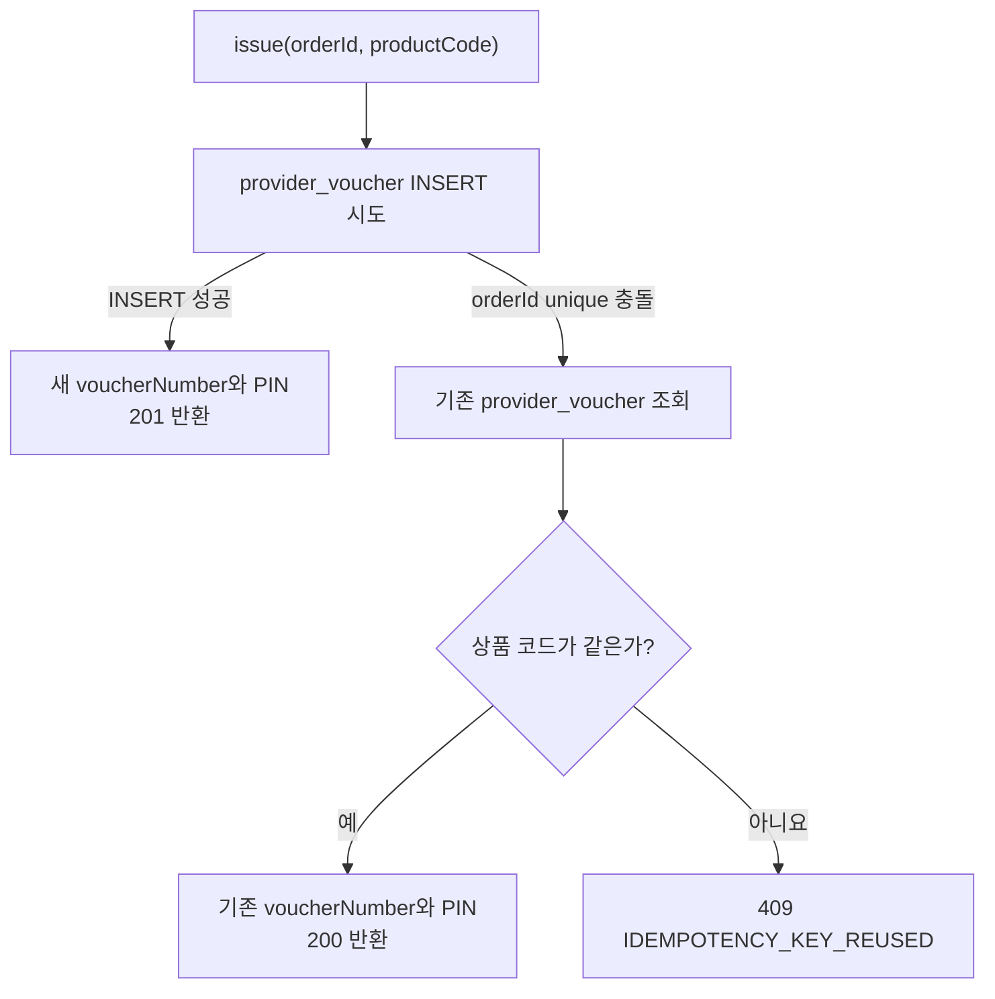
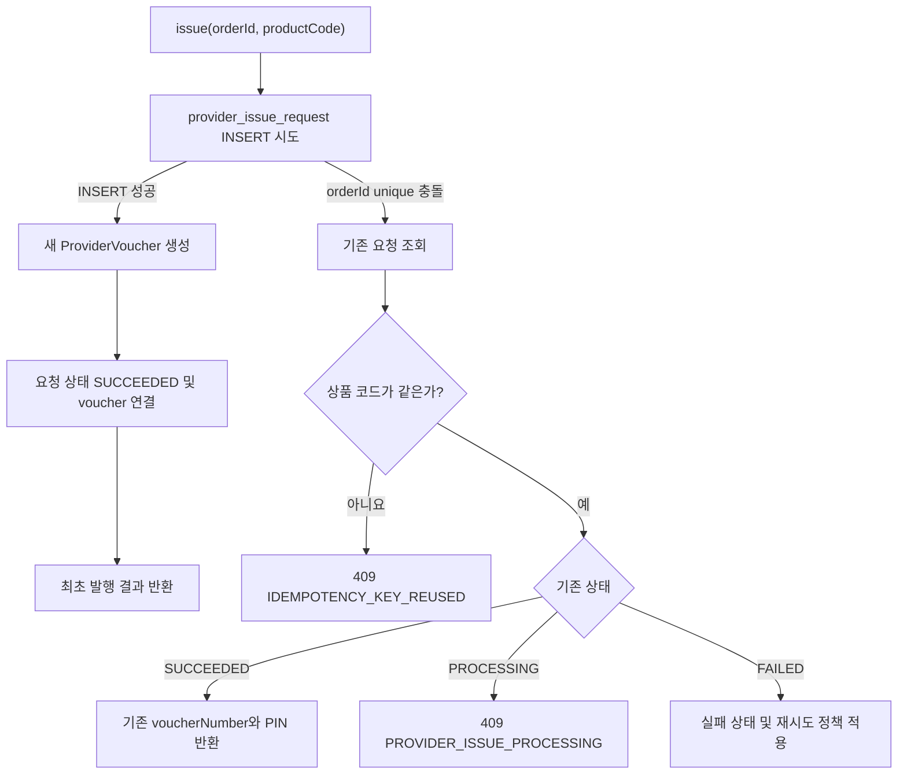

# 외부 바우처 발행 API 멱등성 개선 계획

## 문서 목적

이 문서는 `PaymentAttempt` 기반 1차 개선으로 해결한 범위와 아직 남아 있는 외부 바우처 발행 API의 중복 발행 문제를 구분하고, 2차 개선의 필요성과 목표를 정리한다.

현재 1차 개선은 쇼핑몰 사용자가 결제 API를 중복 호출하는 상황을 방어한다. 그러나 외부 바우처 발행사 Mock API 자체에는 동일한 `orderId`를 중복으로 처리하지 않는 기능이 아직 없다.

## 1차 개선으로 해결된 범위

사용자가 다음 쇼핑몰 결제 API를 호출하면 `payment_attempt.order_id`의 unique 제약으로 동일 주문을 선점한다.

```http
POST /api/payments/point/idempotent
```

처리 흐름:



따라서 쇼핑몰의 멱등 결제 API를 통해 동일한 `orderId` 요청이 동시에 두 번 들어오더라도 최초 요청만 외부 바우처 발행 API를 호출한다.

실제 검증 결과도 다음과 같았다.

| 확인 항목 | 1차 개선 결과 |
| --- | --- |
| 동일 `orderId` 동시 결제 요청 | 2건 |
| 외부 바우처 발행 | 1건 |
| 내부 구매 저장 | 1건 |
| 중복 요청 | `409 PAYMENT_PROCESSING` |
| Deadlock | 발생하지 않음 |
| 보상 취소 | 발생하지 않음 |

## 아직 남아 있는 문제

`payment_attempt`는 쇼핑몰의 `/api/payments/point/idempotent` 요청 경로에서만 확인한다.

외부 Mock 발행 API는 별도의 엔드포인트다.

```http
POST /mock/voucher-provider/vouchers/issue
```

현재 `MockVoucherProviderController.issue()`는 요청을 받을 때마다 다음 작업을 수행한다.

1. `issueCallCount`를 증가시킨다.
2. 새로운 `voucherNumber`를 생성한다.
3. 새로운 `pinNumber`를 생성한다.
4. 새로운 `provider_voucher` 행을 저장한다.
5. 새로 생성한 발행 결과를 반환한다.

이 과정에는 `payment_attempt` 조회나 외부 발행사 자체의 `orderId` 중복 검사가 없다.

따라서 외부 Mock API를 다음과 같이 직접 같은 `orderId`로 두 번 호출하면 쇼핑몰의 `payment_attempt`를 거치지 않는다.

```text
POST /mock/voucher-provider/vouchers/issue
orderId = ORDER-001

POST /mock/voucher-provider/vouchers/issue
orderId = ORDER-001
```

현재 예상 결과:

```text
provider_voucher

ORDER-001 / CP-AAA / ISSUED
ORDER-001 / CP-BBB / ISSUED
```

즉, 동일 주문인데 서로 다른 바우처 번호와 PIN을 가진 쿠폰 두 장이 발행될 수 있다.



## 왜 직접 호출까지 방어해야 하는가

실제 운영에서 외부 발행 API에 같은 요청이 두 번 도착하는 원인은 사용자의 따닥 결제만이 아니다.

- 쇼핑몰이 외부 응답을 받지 못하고 같은 요청을 재시도할 수 있다.
- 외부 발행은 성공했지만 네트워크 타임아웃 때문에 쇼핑몰이 성공 응답을 받지 못할 수 있다.
- 메시지 큐가 같은 메시지를 다시 전달할 수 있다.
- 다른 쇼핑몰, 배치 프로그램 또는 관리자 도구가 동일 주문을 전송할 수 있다.
- 결제 API가 아닌 다른 호출 경로에서 발행사 API를 직접 사용할 수 있다.

그러므로 호출자인 쇼핑몰만 중복 요청을 막는 것으로는 충분하지 않다. 최종적으로 바우처를 생성하는 외부 발행사도 동일 `orderId`에 대한 멱등성을 보장해야 한다.

## 1차와 2차 방어의 차이

| 구분 | 1차 개선 | 2차 개선 |
| --- | --- | --- |
| 보호 계층 | 쇼핑몰 결제 서비스 | 외부 바우처 발행사 |
| 멱등성 기준 | `payment_attempt.order_id` | 발행 요청의 `orderId` |
| 방어 대상 | 사용자의 중복 결제 요청 | 발행사에 도착한 모든 중복 요청 |
| 현재 상태 | 구현 및 검증 완료 | 구현 예정 |
| 핵심 목적 | 외부 API를 한 번만 호출 | 여러 번 호출돼도 한 장만 발행 |


핵심 차이는 다음과 같다.

> 1차 개선은 쇼핑몰이 같은 발행 요청을 두 번 보내지 않도록 막는다.
> 2차 개선은 어떤 이유로 같은 발행 요청이 두 번 도착하더라도 발행사가 바우처를 한 장만 만들도록 막는다.

## 2차 개선 목표

외부 Mock 발행 API에 다음 동작을 구현한다.

1. 최초 `orderId` 요청만 새로운 바우처와 PIN을 생성한다.
2. 같은 `orderId`와 같은 상품 코드로 재요청하면 새 바우처를 만들지 않는다.
3. 재요청에는 최초 발행의 `voucherNumber`와 `pinNumber`를 반환한다.
4. 같은 `orderId`를 다른 상품 코드에 재사용하면 명확한 `409` 오류로 거절한다.
5. 동시 요청에서도 DB unique 제약을 이용해 실제 바우처가 한 장만 생성되도록 한다.
6. API 요청 횟수와 실제 바우처 발행 건수를 구분해서 확인할 수 있게 한다.

목표 결과:

```text
외부 issue API 요청 횟수: 2
실제 provider_voucher 생성: 1
두 응답의 voucherNumber: 동일
두 응답의 pinNumber: 동일
```

주의할 점은 멱등 API가 요청 자체를 한 번만 받는다는 뜻은 아니라는 것이다. 같은 요청을 여러 번 받아도 비즈니스 결과인 바우처 발행이 한 번만 일어나야 한다.

## 구현 전 검토 사항

Legacy 재현 데이터에는 이미 같은 `orderId`의 `provider_voucher`가 여러 건 존재할 수 있다. 따라서 기존 테이블에 곧바로 `provider_voucher.order_id` unique 제약을 추가하면 Flyway migration이 실패할 수 있다.

구현 시 다음 대안을 비교한다.

- 기존 중복 데이터를 정리한 뒤 `provider_voucher.order_id`에 unique 제약을 추가한다.
- Legacy 증거 데이터를 유지하고, `order_id` unique 제약을 가진 별도의 `provider_issue_request` 테이블에서 개선된 발행 요청을 관리한다.

포트폴리오의 Legacy 재현 데이터를 보존해야 한다면 두 번째 방법을 우선 검토한다.

## 중복 요청을 기억하는 방법 비교

새 테이블만이 중복 요청을 방어하는 방법은 아니다. 중복 여부를 판단하려면
처리한 `orderId`와 기존 결과를 어딘가에 저장해야 하며, 저장 위치에 따라
다음 선택지가 있다.

| 방법 | 장점 | 한계 | 현재 적합성 |
| --- | --- | --- | --- |
| 애플리케이션 메모리 `Set`/`Map` | 구현이 매우 단순함 | 재시작 시 소멸, 다중 서버 공유 불가 | 낮음 |
| Redis `SET NX` | 빠르고 다중 서버에서 공유 가능 | 별도 인프라와 만료·장애 정책 필요 | 현재 규모에는 과함 |
| 기존 `provider_voucher.order_id` unique | 추가 테이블 없이 결과 재사용 가능 | 기존 중복 데이터 정리 필요, 요청 상태 표현 제한 | 현재 단계에 적합 |
| 별도 `provider_issue_request` | 처리 상태·실패·재시도 이력 확장에 유리 | 테이블과 코드가 늘어남 | 향후 확장안 |

메모리에서 중복 요청을 단순히 무시하는 방식은 사용하지 않는다. 첫 발행은
성공했지만 응답이 유실된 경우, 재요청 호출자가 바우처 번호와 PIN을 받지
못하기 때문이다. 중복 요청에는 무응답이나 빈 성공이 아니라 최초 발행
결과를 다시 반환해야 한다.

## 현재 단계의 권장안: 기존 `provider_voucher` 활용

현재 2차 개선의 목표는 발행 요청의 상세 상태 관리가 아니라 다음 동작을
검증하는 것이다.

```text
동일 orderId 요청 2건
→ 실제 provider_voucher 1건
→ 두 요청 모두 동일한 voucherNumber와 pinNumber 확인
```

따라서 이번 단계에서는 새 테이블을 추가하지 않고
`provider_voucher.order_id`에 unique 제약을 추가하는 최소 설계를 우선한다.



같은 `orderId`와 같은 상품 코드의 재요청에는 기존 `provider_voucher`의
`voucherNumber`와 `pinNumber`를 반환한다. 같은 `orderId`를 다른 상품에
사용하면 멱등 재시도가 아니라 잘못된 키 재사용이므로 `409`로 거절한다.

### 동시성 처리 원칙

애플리케이션에서 먼저 `findByOrderId()`를 호출하고 결과가 없으면 insert하는
방식만으로는 부족하다. 두 요청이 동시에 조회하면 둘 다 “없음”을 확인하고
바우처를 각각 만들 수 있기 때문이다.

다음 순서로 처리한다.

1. `provider_voucher.order_id`에 DB unique 제약을 둔다.
2. 최초 요청은 새 바우처를 insert하고 `201`로 반환한다.
3. 동시에 들어온 요청 중 unique 충돌이 발생한 요청은 새 트랜잭션에서
   기존 `provider_voucher`를 조회한다.
4. 상품 코드가 같으면 기존 결과와 `Idempotency-Replayed: true`를 반환한다.
5. 상품 코드가 다르면 `409 IDEMPOTENCY_KEY_REUSED`를 반환한다.

DB unique 제약이 최종 동시성 방어선이다. 사전 조회는 빠른 재사용 판단에는
도움이 되지만 unique 제약을 대체하지 않는다.

### 기존 중복 데이터 migration 고려사항

이미 같은 `order_id`를 가진 Legacy 데이터가 있으면 unique 제약을 추가하는
Flyway migration이 실패한다. 구현 전에 다음 중 하나를 명시적으로 선택한다.

- 실습 DB를 초기화하고 V1부터 migration을 다시 적용한다.
- V5 migration에서 중복 데이터 처리 기준을 정의하고 정리한 뒤 unique 제약을 추가한다.
- Legacy DB 데이터를 그대로 유지해야 한다면 별도 `provider_issue_request`
  테이블 방식으로 전환한다.

로컬 실습 DB는 초기화할 수 있고 Legacy 결과는 `evidence`와 문서에 보존되어
있으므로, 현재 프로젝트에서는 DB 초기화 후 unique 제약을 적용하는 방법이
가장 단순하다. 다만 운영 migration이라면 기존 데이터를 임의로 삭제하지
말고 중복 건을 조사·보정하는 절차가 선행되어야 한다.

## 향후 확장안: `provider_issue_request`

다음 요구사항이 생기면 별도 요청 테이블을 도입한다.

- `PROCESSING`, `SUCCEEDED`, `FAILED` 상태를 별도로 추적
- 실패 원인과 재시도 횟수 기록
- 비동기 발행과 장시간 처리 상태 복구
- 요청 접수 이력과 실제 바우처를 분리해서 감사
- reconciliation과 운영 알림

예상 구조:

```text
provider_issue_request

id                    PK
order_id              UNIQUE, NOT NULL
voucher_product_code  NOT NULL
provider_voucher_id   UNIQUE, NULL
status                NOT NULL
created_at            NOT NULL
updated_at            NOT NULL
```

확장 설계 흐름:



### API 응답 규칙

| 상황 | 응답 |
| --- | --- |
| 최초 발행 성공 | `201 Created`, 새 발행 결과 |
| 완료된 동일 요청 재호출 | `200 OK`, 기존 발행 결과, `Idempotency-Replayed: true` |
| 동일 `orderId`, 다른 상품 코드 | `409 IDEMPOTENCY_KEY_REUSED` |

기존 `IssueVoucherResponse`의 `voucherNumber`, `pinNumber`는 그대로 유지하고,
최초 응답과 재사용 응답은 HTTP 상태 및 `Idempotency-Replayed` 헤더로
구분하는 방식을 권장한다.

## 구현 TODO

### A. 개선 전 기준선 확보

- [x] 같은 `orderId`와 상품 코드로 Mock issue API를 동시에 두 번 호출하는 스크립트를 작성한다.
- [x] 개선 전 HTTP 응답 A/B를 저장한다.
- [x] 동일 `orderId`의 `provider_voucher`가 두 건 생성되는지 DB 결과를 저장한다.
- [x] 요청 2건에서 실제 바우처 생성 건수 `= 2`를 확인한다.

### B. DB 및 repository

- [x] 기존 DB의 중복 `provider_voucher.order_id`를 조회한다.
- [x] 로컬 DB 초기화 또는 기존 데이터 정리 방법을 결정한다.
- [x] Flyway V5로 `provider_voucher.order_id` unique 제약을 추가한다.
- [x] `ProviderVoucherRepository.findByOrderId(...)`를 추가한다.
- [x] unique 제약이 JPA schema validation을 통과하는지 확인한다.

### C. 외부 Mock 발행 로직

- [x] `MockVoucherProviderController`의 발행 로직을 별도 service로 이동한다.
- [x] 최초 요청은 새 `voucherNumber`, `pinNumber`를 생성하고 저장한다.
- [x] 동일 `orderId`, 동일 상품 재요청은 기존 발행 결과를 반환한다.
- [x] 동일 `orderId`, 다른 상품 요청은 `409 IDEMPOTENCY_KEY_REUSED`로 거절한다.
- [x] 동시 insert unique 충돌 후 기존 결과를 안전하게 다시 조회한다.
- [x] 최초 응답은 `201`, 재사용 응답은 `200`으로 구분한다.
- [x] 재사용 응답에 `Idempotency-Replayed: true` 헤더를 추가한다.

### D. 자동 테스트

- [x] 최초 요청이 새 바우처 결과를 반환하는 단위 테스트를 추가한다.
- [x] 순차 재요청이 같은 바우처 번호와 PIN을 반환하는 단위 테스트를 추가한다.
- [x] 다른 상품 코드로 같은 `orderId`를 사용하면 conflict가 되는 단위 테스트를 추가한다.
- [ ] 동시 요청 두 건에서 실제 바우처가 한 장만 생성되는 통합 테스트를 추가한다.
- [x] 전체 `./gradlew test`를 실행한다.

### E. 실제 검증 및 포트폴리오 증거

- [x] 개선 후 같은 동시 호출 스크립트를 실행한다.
- [x] HTTP 응답 A/B와 DB 조회 결과를 `evidence`에 저장한다.
- [x] 동시 API 요청 2회와 실제 바우처 생성 1건을 비교한다.
- [x] 두 성공 응답의 `voucherNumber`, `pinNumber`가 같은지 확인한다.
- [x] 개선 전후 비교표와 시퀀스 다이어그램을 결과 문서에 추가한다.
- [x] 검증 결과와 완료 상태를 `docs/worklog-and-todo.md`에 갱신한다.

## 2026-07-28 구현 및 실제 검증 결과

개선 전 `PROVIDER-BASELINE-001`로 동시 요청 두 건을 보냈다.

| 요청 | HTTP | voucherNumber | pinNumber |
| --- | ---: | --- | --- |
| A | 200 | `CP-0d27b907-65f8-4094-8773-5f141775a287` | `PIN-05042d9f` |
| B | 200 | `CP-a5c037a7-5d43-4f32-9aae-14c86e1804e5` | `PIN-9f397e69` |

DB에는 같은 `order_id`의 `ISSUED` 바우처가 두 건 저장됐다.

개선 후 `PROVIDER-IDEMPOTENT-001`로 같은 실험을 실행했다.

| 요청 | HTTP | voucherNumber | pinNumber |
| --- | ---: | --- | --- |
| A | 200 | `CP-0bab360e-9dcc-4901-b051-fcc239adb59f` | `PIN-64bf3931` |
| B | 201 | `CP-0bab360e-9dcc-4901-b051-fcc239adb59f` | `PIN-64bf3931` |

두 요청이 받은 발행 결과는 동일했고 DB에는 한 건만 저장됐다.

추가 검증:

- 완료된 같은 요청을 다시 호출하면 `HTTP 200`과
  `Idempotency-Replayed: true`를 반환했다.
- 같은 `orderId`와 다른 상품 코드는 `HTTP 409`,
  `IDEMPOTENCY_KEY_REUSED`로 거절됐다.
- Flyway V1~V5 적용과 Hibernate schema validation을 통과했다.
- `./gradlew test`가 성공했고 전체 테스트 9개가 통과했다.
- 기존 쇼핑몰 `POST /api/payments/point/idempotent` 동시 요청 회귀 테스트도
  HTTP 201/409 `PAYMENT_PROCESSING`으로 정상 동작했다.

개선 전후 비교:

| 검증 항목 | 개선 전 | 개선 후 |
| --- | ---: | ---: |
| 동시 issue 요청 | 2 | 2 |
| 실제 바우처 생성 | 2 | 1 |
| 서로 다른 바우처 번호 | 2 | 1 |
| 결과 재사용 | 불가능 | 가능 |
| 다른 상품 코드로 키 재사용 | 새 발행 가능 | 409 거절 |

증거:

- `evidence/provider-issue-idempotency/response-a.txt`
- `evidence/provider-issue-idempotency/response-b.txt`
- `evidence/provider-issue-idempotency/db-before.txt`
- `evidence/provider-issue-idempotency/after/`

남은 자동화:

- 현재 동시성은 실제 HTTP 스크립트와 DB 조회로 검증했다.
- CI에서 반복 실행할 수 있는 DB 기반 동시 요청 통합 테스트는 아직 추가하지 않았다.

### 사용자 수동 재검증

2026-07-28 로컬 8080 서버에서 `PROVIDER-TEST-001`로 직접 재검증했다.

최초 동시 호출:

```text
response A: HTTP 201
response B: HTTP 200
voucherNumber: CP-0a7a1d33-d0a9-42cb-a559-310ac2cb6b35
pinNumber: PIN-5ee3e840
```

두 응답의 바우처 번호와 PIN이 동일했다.

같은 스크립트를 같은 `orderId`로 다시 호출한 결과:

```text
response A: HTTP 200
response B: HTTP 200
voucherNumber: CP-0a7a1d33-d0a9-42cb-a559-310ac2cb6b35
pinNumber: PIN-5ee3e840
```

완료된 요청이 새 바우처를 만들지 않고 기존 결과를 계속 반환하는 것을
사용자 환경에서도 확인했다. 다른 상품 코드로 같은 `orderId`를 호출하는
테스트에서는 `HTTP 409`, `IDEMPOTENCY_KEY_REUSED`를 확인했다.

DB 조회 결과도 다음과 같이 한 건만 존재했다.

```text
id: 6
orderId: PROVIDER-TEST-001
voucherProductCode: VOUCHER-COFFEE-5000
voucherNumber: CP-0a7a1d33-d0a9-42cb-a559-310ac2cb6b35
pinNumber: PIN-5ee3e840
status: ISSUED
createdAt: 2026-07-28 22:29:53.467064
```

따라서 사용자 환경에서도 동시 요청과 반복 재요청 이후 실제 바우처가 한
장만 저장되는 것을 확인했다.

### 이번 단계에서 하지 않을 것

- 쇼핑몰 잔액 선검증은 3차 개선에서 처리한다.
- 외부 취소 실패 재시도와 outbox는 4차 개선에서 처리한다.
- 바우처 사용(Redemption)은 별도 기능 TODO로 유지한다.
- `AtomicLong` 호출 횟수의 영속화는 이번 멱등성 핵심 범위에서 제외한다.
  동일 서버 실행 중 요청 횟수와 DB의 실제 발행 건수를 비교하는 용도로 사용한다.

## 검증 계획

개선 전과 개선 후에 동일한 `orderId`로 외부 Mock 발행 API를 동시에 두 번 호출한다.

비교할 항목:

| 검증 항목 | 개선 전 예상 | 개선 후 목표 |
| --- | ---: | ---: |
| 외부 issue 요청 | 2 | 2 |
| 실제 바우처 생성 | 2 | 1 |
| 서로 다른 바우처 번호 | 2 | 1 |
| 같은 요청의 결과 재사용 | 불가능 | 가능 |
| 다른 상품 코드로 `orderId` 재사용 | 새 바우처 발행 가능 | `409` 거절 |

검증 자료는 HTTP 응답 A/B, `provider_voucher` 조회 결과, 호출 횟수, 실제 발행 건수와 개선 전후 시퀀스 다이어그램으로 남긴다.
