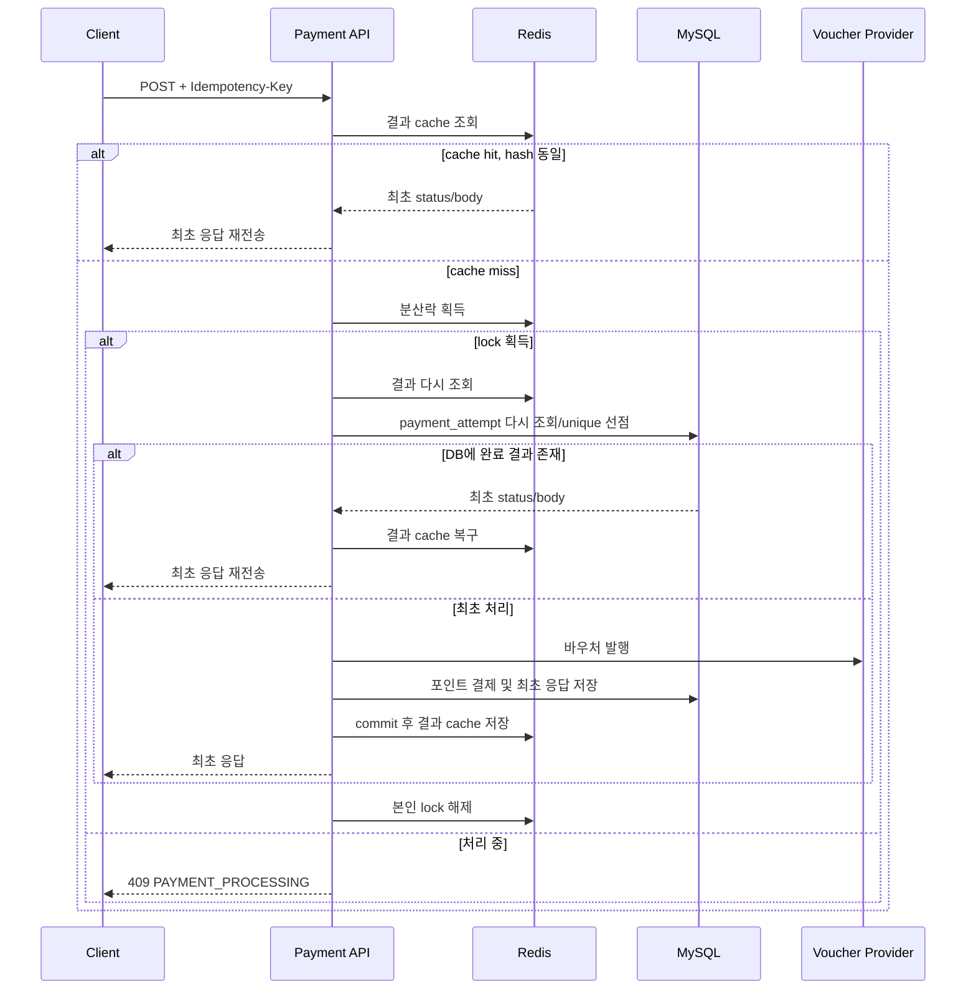

# Redis + DB 결제 멱등성 설계

> 2026-08-30 구현과 검증을 완료했다. 실제 코드 흐름과 두 인스턴스·장애 검증
> 결과는 `docs/redis-payment-idempotency-result.md`에서 확인한다.

## 목적

결제 요청이 네트워크 타임아웃, 클라이언트 재시도, 사용자의 연속 클릭으로
여러 번 도착해도 결제는 한 번만 실행하고, 완료된 동일 요청에는 최초 응답을
그대로 반환한다.

이 설계는 DB와 Redis 중 하나를 선택하지 않는다.

```text
MySQL = 정확성과 복구를 위한 최종 기록
Redis = 여러 서버의 동시 실행 억제와 빠른 응답 재사용
```

## 첨부 자료에서 적용할 원칙

- POST는 본래 멱등하지 않으므로 서버가 멱등성을 구현한다.
- 클라이언트는 `Idempotency-Key` 헤더에 UUID 같은 고유 키를 보낸다.
- 같은 키의 완료 요청은 실제 결제를 다시 실행하지 않고 최초 응답을 반환한다.
- 같은 키를 다른 payload에 재사용하면 `422`로 거절한다.
- 같은 키의 최초 요청이 아직 처리 중이면 `409`로 응답할 수 있다.
- 멱등키는 키 하나만 보지 않고 클라이언트, HTTP method, API path 범위에서 식별한다.
- 멱등키와 최초 응답은 정해진 보관 기간 동안 유지한다.

## 왜 DB와 Redis를 함께 사용하는가

### DB가 필요한 이유

Redis lock과 cache는 만료되거나 사라질 수 있다.

- lock TTL이 결제 처리 중 만료될 수 있다.
- Redis가 재시작되거나 장애가 날 수 있다.
- 결과 cache가 TTL 또는 eviction으로 제거될 수 있다.
- 결제 성공 후 cache 저장 전에 애플리케이션이 종료될 수 있다.

따라서 Redis만 믿으면 같은 결제가 다시 실행될 가능성이 있다.
`payment_attempt`의 unique 제약과 저장된 최초 응답을 최종 방어선으로 유지한다.

### Redis가 추가로 좋은 이유

- 여러 애플리케이션 인스턴스가 같은 요청을 동시에 실행하는 것을 앞단에서 줄인다.
- 중복 요청이 매번 DB unique 충돌까지 내려가는 부하를 줄인다.
- 완료된 응답을 DB 조회 없이 빠르게 반환한다.
- 한 서버의 로컬 메모리와 달리 모든 서버가 lock과 결과를 공유한다.
- 동일 키 요청을 한 실행으로 합치는 single-flight 동작을 구현할 수 있다.

Redis는 정확성의 유일한 근거가 아니라 성능과 분산 조율 계층이다.

## 멱등키 범위

API:

```http
POST /api/payments/point/redis-idempotent
Idempotency-Key: 5bcb1e65-...
```

멱등 요청을 식별하는 논리 키:

```text
clientId + HTTP method + API path + Idempotency-Key
```

현재 인증 시스템이 없으므로 실습에서는 `clientId = point-payment-lab-mall`을
고정값으로 사용한다. 향후 API key 또는 merchant ID가 생기면 이를 clientId로
교체한다.

요청 payload는 정규화한 뒤 SHA-256 hash로 저장한다.

```text
orderId
pointWalletUid
voucherProductId
pointBalanceId
point
```

같은 논리 키와 같은 hash는 재시도이고, 같은 키와 다른 hash는 키 오용이다.

## DB 설계

기존 `payment_attempt`을 최종 멱등성 저장소로 확장한다.

추가 권장 컬럼:

```text
idempotency_key  varchar(100)  not null
client_id        varchar(100)  not null
http_method      varchar(10)   not null
api_path         varchar(255)  not null
request_hash     char(64)      not null
http_status      int           null
response_body    json          null
expires_at       datetime(6)   not null
```

unique 범위:

```text
unique(client_id, http_method, api_path, idempotency_key)
```

`order_id` unique는 주문 자체의 중복을 막는 비즈니스 제약으로 유지한다.
멱등키 unique는 API 재시도를 식별하는 기술적 제약이다. 두 키의 역할이 다르다.

현재 `PaymentAttempt.toResponse()`는 재호출 시 message를 새 문구로 만들어
최초 응답과 정확히 같지 않다. `http_status`와 직렬화된 `response_body`를
저장해 최초 status/body를 그대로 복원하도록 변경한다.

## Redis 키 설계

논리 키 원문을 그대로 노출하지 않고 scope hash를 사용한다.

```text
scopeHash = SHA-256(clientId|method|path|idempotencyKey)
```

분산락:

```text
idem:payment:{scopeHash}:lock
```

완료 결과 cache:

```text
idem:payment:{scopeHash}:result
```

cache value:

```json
{
  "requestHash": "...",
  "httpStatus": 201,
  "responseBody": {
    "message": "A voucher has been issued successfully",
    "orderId": "ORDER-001",
    "voucherNumber": "CP-...",
    "pinNumber": "PIN-...",
    "pointAmount": 5000,
    "balanceAfterPayment": "5000"
  }
}
```

실습 TTL 권장값:

- lock: Redisson watchdog 사용 또는 최대 처리 시간보다 긴 lease
- 결과 cache: 1시간
- DB 멱등 기록: 24시간 이상

TTL은 운영 요구사항에 따라 정한다. DB 보관 기간은 Redis cache보다 길어야
cache miss 시 결과를 복구할 수 있다.

PIN이 결과 cache에 포함되므로 Redis는 private network, 인증, TLS, 접근 권한,
짧은 TTL을 적용해야 한다. 운영에서는 cache 값 암호화도 검토한다.

## 요청 처리 흐름



lock 획득 후 Redis와 DB를 다시 확인하는 double check가 필요하다. lock을
기다리는 동안 앞선 요청이 결제를 완료했을 수 있기 때문이다.

## 분산락 구현

실습 구현은 Redisson `RLock`을 사용한다.

- 여러 서버가 같은 Redis lock을 공유한다.
- lock 획득 대기 시간을 제한한다.
- lease time을 직접 잘못 계산하는 위험을 줄이기 위해 watchdog을 활용한다.
- `finally`에서 현재 thread가 lock owner일 때만 해제한다.

DB unique 제약은 그대로 유지한다. lock이 예상보다 일찍 풀리거나 Redis가
장애여도 DB가 중복 결제를 최종 차단한다.

## Redisson 상세 설명

### Redisson이란

Redisson은 Java 애플리케이션에서 Redis를 분산 자료구조와 분산 동시성
도구처럼 사용할 수 있게 해주는 Redis client library다.

```text
Java Lock, Map, Queue와 유사한 API
-> Redisson
-> Redis 명령과 Lua script
-> 여러 애플리케이션 인스턴스가 공유
```

Spring Data Redis가 문자열, hash, list 같은 Redis 자료구조와 명령을
사용하는 일반적인 접근을 제공한다면, Redisson은 `RLock`, `RMap`,
`RBucket`, semaphore 등 분산 환경의 고수준 기능을 제공한다.

이 프로젝트에서는 주로 다음 두 기능을 사용한다.

| Redisson 기능 | 프로젝트 역할 |
| --- | --- |
| `RLock` | 같은 멱등키 결제의 동시 실행 억제 |
| `RBucket` 또는 별도 cache abstraction | 최초 결제 응답의 임시 cache |

### Java 로컬 lock과의 차이

`synchronized`와 `ReentrantLock`은 한 JVM 안에서만 공유된다.

```text
서버 A의 ReentrantLock
!= 서버 B의 ReentrantLock
```

8081과 8082 두 서버가 같은 결제 요청을 받으면 각 서버는 자신의 lock을
획득하므로 결제를 동시에 실행할 수 있다.

Redisson `RLock`은 두 서버가 같은 Redis key를 바라보게 한다.

```text
서버 A ─┐
        ├─ Redis key: idem:payment:{hash}:lock
서버 B ─┘
```

한 서버가 lock을 획득하면 다른 서버는 같은 key의 lock을 동시에 획득할 수
없다.

### Redis 명령을 직접 구현할 때 필요한 것

분산락을 직접 구현한다면 다음과 같은 원자적 명령이 필요하다.

```text
SET idem:payment:{hash}:lock {randomToken} NX PX 10000
```

- `NX`: key가 없을 때만 lock을 만든다.
- `PX 10000`: 서버 장애 시 lock이 영원히 남지 않도록 10초 TTL을 둔다.
- `randomToken`: 어느 요청이 lock 소유자인지 구분한다.

해제 시 단순 `DEL`을 사용하면 안 된다.

```text
1. 서버 A의 lock TTL 만료
2. 서버 B가 같은 key로 새 lock 획득
3. 서버 A가 뒤늦게 DEL 실행
4. 서버 B의 정상 lock까지 삭제
```

따라서 token이 현재 값과 같은 경우에만 삭제하는 Lua script가 필요하다.

```lua
if redis.call("get", KEYS[1]) == ARGV[1] then
    return redis.call("del", KEYS[1])
end
return 0
```

Redisson은 소유권 확인과 원자적 해제를 내부에서 처리하므로 직접 구현해야
할 동시성 세부사항을 줄여준다.

### Watchdog

고정 TTL이 10초인데 외부 API 지연으로 결제가 15초 걸리면 처리 도중 lock이
풀릴 수 있다. 그러면 다른 서버가 같은 lock을 획득한다.

Redisson watchdog은 애플리케이션과 lock 소유 thread가 정상 동작하는 동안
lock TTL을 주기적으로 연장한다.

```text
lock 소유 서버 정상
-> TTL 자동 연장

서버 종료 또는 연결 단절
-> 연장 중단
-> TTL이 지나면 lock 자동 제거
```

watchdog을 사용하려면 임의의 고정 lease time을 지정하는 방식과 동작 차이를
확인해야 한다. 구현 시 Redisson 설정의 watchdog timeout, 최대 결제 처리
시간, 외부 API timeout을 함께 조정한다.

### 프로젝트 적용 예시

```java
RLock lock = redissonClient.getLock(lockKey);
boolean acquired = lock.tryLock(waitTime, TimeUnit.SECONDS);

if (!acquired) {
    throw new PaymentProcessingException();
}

try {
    // 기다리는 사이 앞 요청이 끝났을 수 있으므로 cache와 DB를 다시 확인한다.
    return findCachedOrStoredResult()
            .orElseGet(() -> processPaymentAndStoreResult(request));
} finally {
    if (lock.isHeldByCurrentThread()) {
        lock.unlock();
    }
}
```

실제 코드에서는 다음을 추가로 처리한다.

- lock key에 raw 멱등키 대신 scope hash 사용
- lock 획득 대기 시간 제한
- `finally`에서 소유권 확인 후 해제
- lock 획득 후 Redis와 DB double check
- DB commit 이후에만 결과 cache 저장
- Redis 오류 시 기존 DB 멱등성 경로로 fallback

### Redisson이 해결하지 못하는 문제

Redisson을 추가해도 다음 문제가 자동으로 해결되지는 않는다.

```text
1. 서버가 lock 획득
2. 외부 바우처 발행 성공
3. 내부 DB 기록 전 서버 종료
4. lock TTL 만료
5. 다른 서버가 요청 재처리
```

또한 Redis cluster 장애, network partition, lock TTL 경계 상황도 발생할 수
있다. 따라서 다음 역할 분리가 필요하다.

```text
Redisson RLock
-> 정상 상황의 동시 실행 억제

payment_attempt DB unique
-> Redis 이상 상황까지 포함한 최종 중복 방어

DB 최초 응답 저장
-> cache 유실 후 결과 복구

provider orderId unique
-> 외부 발행사 계층의 마지막 중복 발행 방어
```

### Redisson 사용 시 주의사항

- 분산락 범위를 결제에 필요한 최소 구간으로 제한한다.
- lock을 획득한 채 무제한 대기하는 외부 호출을 만들지 않는다.
- 외부 API connect/read timeout을 반드시 설정한다.
- lock key cardinality와 TTL을 모니터링한다.
- Redis 장애가 결제 전체 장애로 바로 번지지 않도록 fallback 정책을 둔다.
- `isLocked()`만 확인한 뒤 작업하는 check-then-act 방식을 사용하지 않는다.
- lock이 있어도 DB transaction과 unique 제약을 제거하지 않는다.
- 단일 Redis 장애 가능성을 고려해 운영 topology를 결정한다.

### Redisson을 도입했을 때 보여줄 포트폴리오 지표

| 지표 | DB-only | Redis + DB |
| --- | ---: | ---: |
| 동일 키 동시 요청 수 | 동일 | 동일 |
| 외부 발행 횟수 | 1 | 1 |
| DB unique 충돌 수 | 중복 요청만큼 발생 가능 | 크게 감소 |
| 완료 재요청 DB 조회 | 발생 | cache hit이면 0 |
| Redis 장애 시 중복 방지 | 해당 없음 | DB fallback으로 유지 |

분산락 도입의 효과는 “외부 발행이 1회”만으로 평가하면 DB-only 방식과
차이가 보이지 않을 수 있다. DB unique 충돌 수, DB 조회 수, cache hit,
응답 시간과 두 인스턴스 간 동시 실행 여부를 함께 측정한다.

## 오류 정책

| 상황 | 응답 |
| --- | --- |
| `Idempotency-Key` 누락·형식 오류 | `400 IDEMPOTENCY_KEY_REQUIRED` |
| 같은 키의 요청 처리 중 | `409 PAYMENT_PROCESSING` |
| 같은 키, 다른 payload | `422 IDEMPOTENCY_KEY_REUSED` |
| 완료된 같은 요청 | 최초 HTTP status/body 재전송 |
| Redis 장애 | DB 기반 멱등성으로 fallback |

처리 중 요청에도 반드시 같은 응답을 즉시 줄 수 있는 것은 아니다. 최초
요청의 결과가 아직 존재하지 않기 때문이다. 첨부 자료처럼 이때는 409를
반환하고 재시도를 안내한다. 최초 요청이 완료된 뒤에는 같은 응답을 반환한다.

## 장애 시나리오

| 장애 | 처리 |
| --- | --- |
| Redis cache miss | DB 완료 결과 조회 후 cache 복구 |
| Redis 전체 장애 | DB `payment_attempt` 경로로 fallback |
| lock TTL 만료 | DB unique가 중복 실행 최종 차단 |
| DB commit 후 cache 저장 전 장애 | 재요청이 DB 결과를 읽어 cache 복구 |
| 앱 서버 중단, DB가 PROCESSING | timeout/reconciliation 대상으로 관리 |
| 같은 키, 다른 payload | DB 또는 cache의 request hash 비교 후 422 |

## 구현 단계 및 상태

1. [x] 현재 2차·3차 개선을 먼저 커밋한다.
2. [x] Docker Compose에 localhost 바인딩 Redis를 추가한다.
3. [x] Redis/Redisson 설정을 환경변수화한다.
4. [x] 새 `/redis-idempotent` API에서 `Idempotency-Key`를 필수로 받는다.
5. [x] DB migration으로 멱등키 범위, request hash, 최초 status/body를 저장한다.
6. [x] DB fallback 경로에서 최초 응답을 정확하게 replay한다.
7. [x] Redis 결과 cache를 추가한다.
8. [x] Redisson 분산락과 lock 후 double check를 추가한다.
9. [x] Redis 장애 fallback을 구현한다.
10. [x] 8080과 8081 인스턴스에서 같은 키를 동시에 호출한다.
11. [x] Redis 정상·중단·cache miss·재시작 시나리오를 검증한다.
12. [x] DB-only와 Redis+DB의 외부 호출 수, DB 충돌 수, 응답 시간을 비교한다.

비교 결과는 `docs/redis-payment-idempotency-result.md`와
`evidence/redis-idempotency/benchmark/`에 기록했다.

## 완료 조건

- 동일 키·동일 payload의 완료 재요청은 최초 status/body와 같다.
- 동일 키·다른 payload는 외부 호출 없이 422다.
- 두 애플리케이션 인스턴스의 동시 요청에서도 외부 발행과 내부 결제는 한 번이다.
- Redis cache가 없어도 DB에서 최초 결과를 복원한다.
- Redis가 중단되어도 DB unique로 중복 결제를 막는다.
- Redis에 PIN이 무기한 또는 보호 없이 저장되지 않는다.
