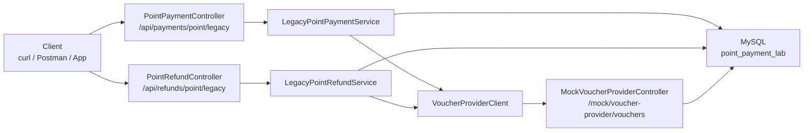
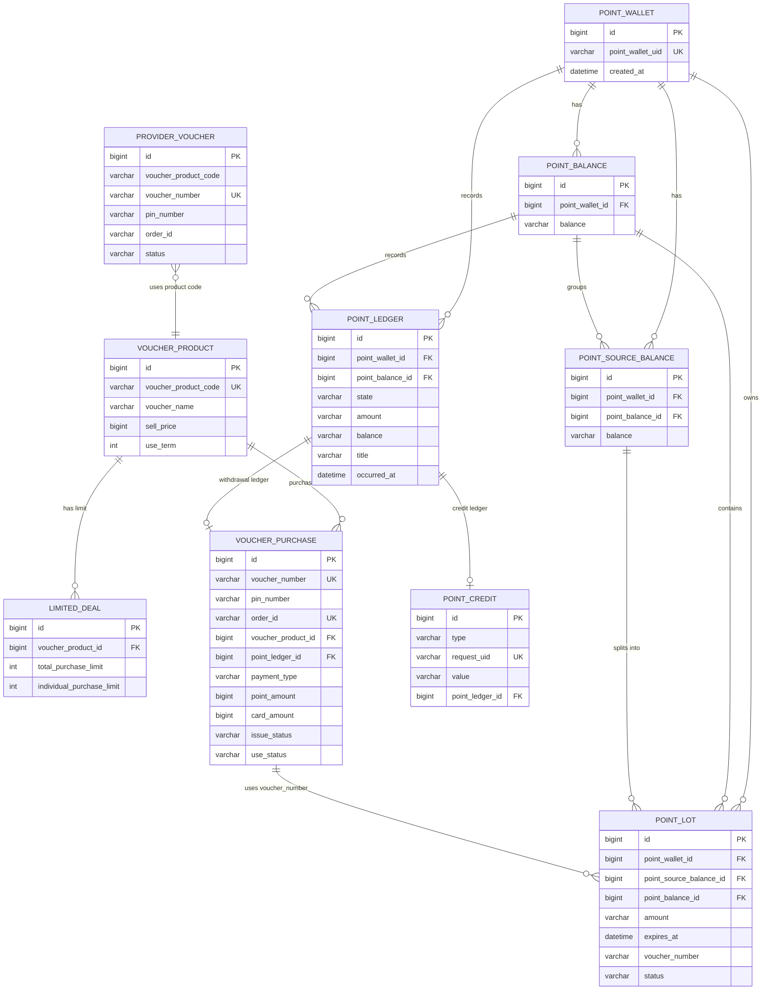
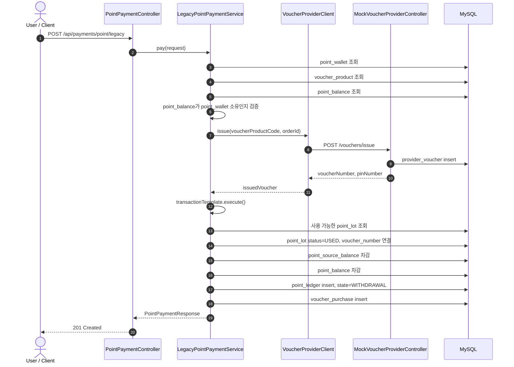
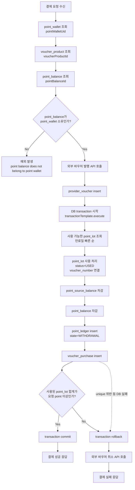
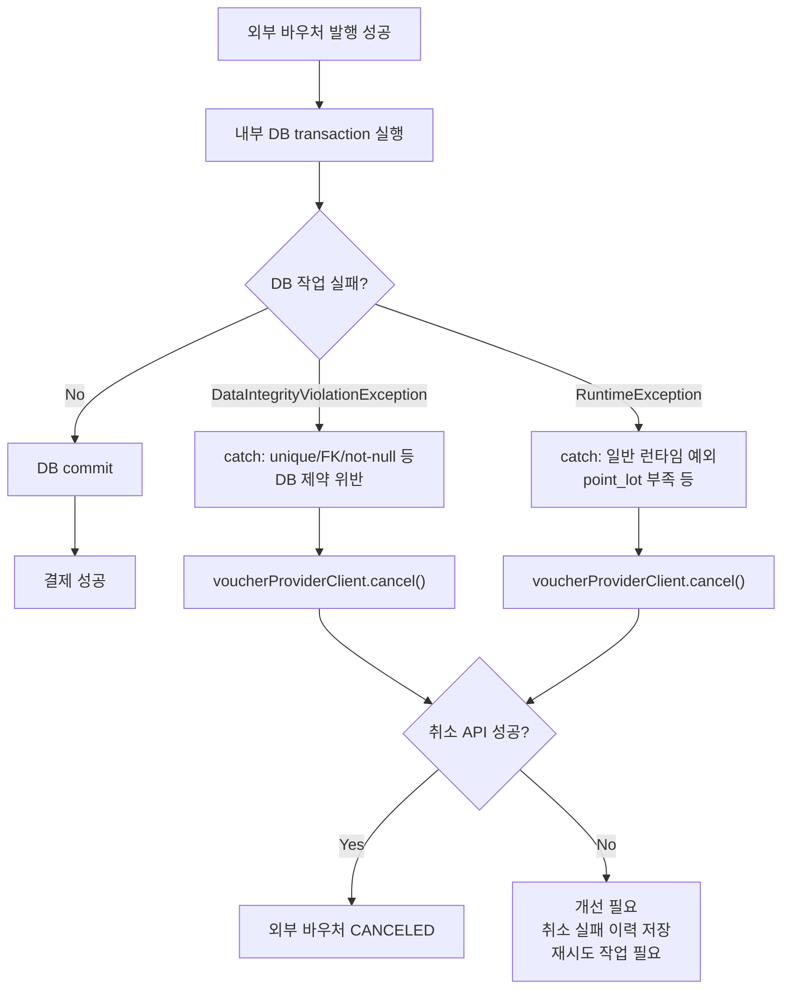
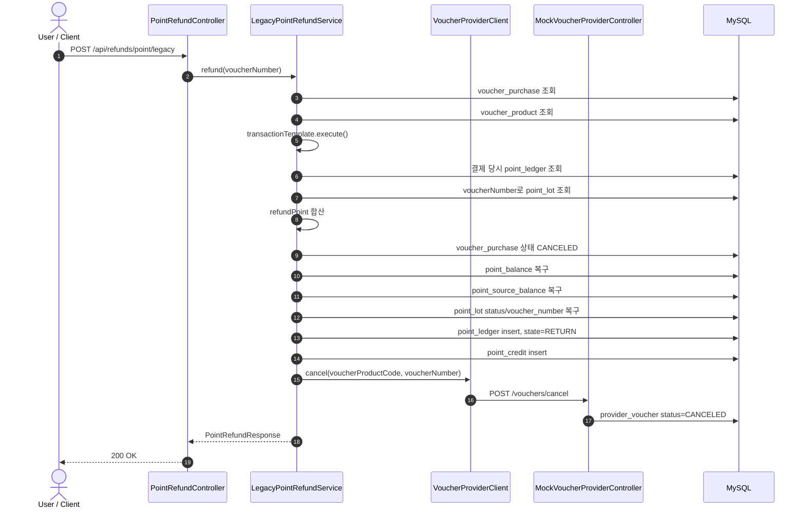
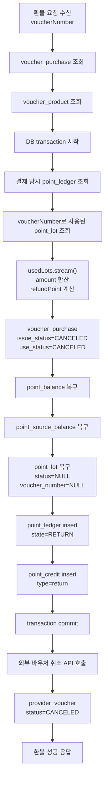
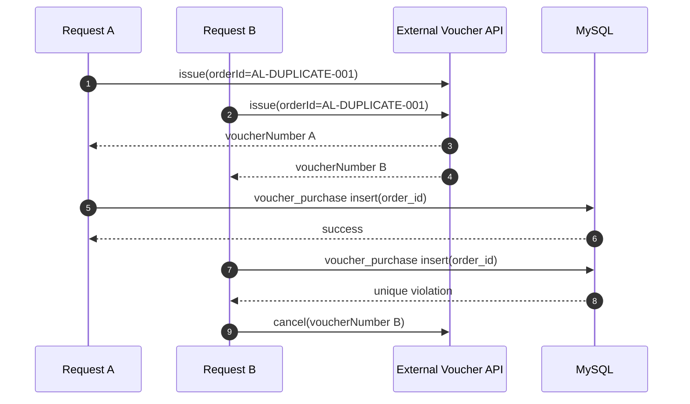
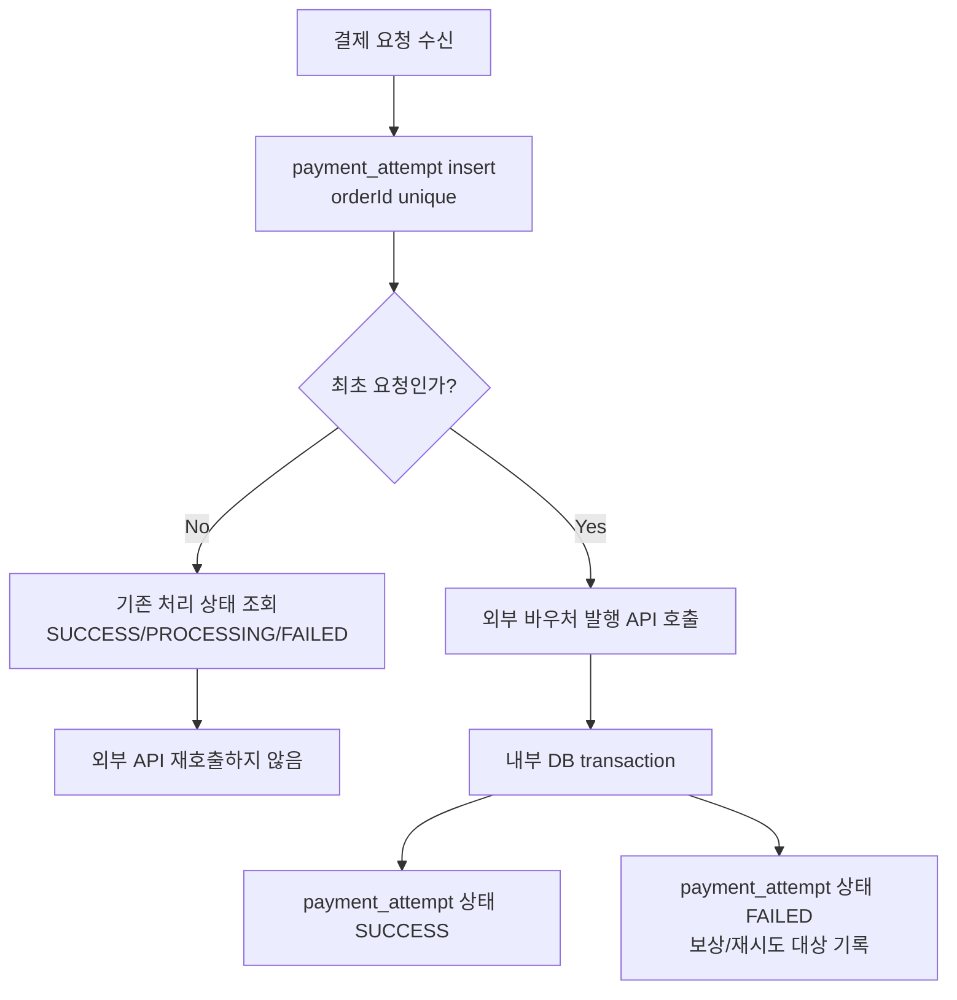

# 테이블 구조와 로직 시각화

이 문서는 `point-payment-lab`의 테이블 관계와 포인트 결제/환불 흐름을 그림으로 정리한다.

Mermaid를 지원하는 Markdown 뷰어에서 열면 다이어그램으로 볼 수 있다.

## 1. 전체 구성



역할을 나누면 다음과 같다.

| 영역 | 역할 |
| --- | --- |
| `payment` | 포인트 결제 요청 처리, 포인트 차감, 결제 이력 저장 |
| `refund` | 포인트 환불 요청 처리, 포인트 복구, 환불 이력 저장 |
| `provider` | 외부 바우처 제공사 API 호출 및 mock API 제공 |
| `common` | 금액 계산, 공통 예외 처리 |
| `db/migration` | 테이블 생성, seed 데이터 입력, comment 추가 |

## 2. 테이블 관계 ERD



## 3. 테이블 역할 요약

| 테이블 | 역할 | 데이터 생성/변경 시점 |
| --- | --- | --- |
| `point_wallet` | 사용자 포인트 지갑 | seed 데이터로 생성 |
| `voucher_product` | 구매 가능한 바우처 상품 | seed 데이터로 생성 |
| `limited_deal` | 한정 판매 제한 정보 | 현재 흐름에서는 직접 사용하지 않음 |
| `point_balance` | 지갑 기준 총 포인트 잔액 | seed 생성, 결제 시 차감, 환불 시 복구 |
| `point_source_balance` | 포인트 출처별 잔액 | seed 생성, 결제 시 차감, 환불 시 복구 |
| `point_lot` | 만료일이 있는 포인트 묶음 | seed 생성, 결제 시 `USED`, 환불 시 복구 |
| `provider_voucher` | 외부 바우처 API mock 결과 | 외부 발행 API 호출 시 생성, 취소 API 호출 시 `CANCELED` |
| `voucher_purchase` | 내부 구매/결제 결과 | 결제 transaction 안에서 생성, 환불 시 취소 상태 변경 |
| `point_ledger` | 포인트 사용/환불 원장 | 결제 시 `WITHDRAWAL`, 환불 시 `RETURN` 생성 |
| `point_credit` | 환불성 포인트 입금 기록 | 환불 transaction 안에서 생성 |

## 4. 정상 포인트 결제 시퀀스



핵심 포인트:

```text
외부 바우처 발행 API 호출
-> provider_voucher insert
-> 그 다음 내부 DB transaction 실행
```

즉 외부 발행은 DB transaction 밖에서 먼저 일어난다.

## 5. 정상 포인트 결제 플로우차트



## 6. 결제 실패와 보상 취소 흐름



현재 구현은 `cancel()`을 즉시 호출하지만, 취소 API 자체가 실패할 경우를 저장하고 재시도하는 구조는 아직 없다.

## 7. 포인트 환불 시퀀스



핵심 포인트:

```text
내부 DB 환불 transaction
-> 그 다음 외부 바우처 취소 API 호출
```

현재 환불 흐름은 내부 DB 환불이 먼저 완료된다. 따라서 외부 취소 API가 실패하면 내부는 환불 완료인데 외부 바우처는 아직 유효한 상태가 될 수 있다.

## 8. 포인트 환불 플로우차트



## 9. 따닥 결제 문제 시각화



현재 구조에서 DB의 `voucher_purchase.order_id` unique 제약은 내부 중복 저장을 막는다.

하지만 외부 바우처 API 호출은 그 전에 이미 일어난다.

그래서 같은 `orderId` 요청이 동시에 들어오면 외부 바우처가 두 번 발행될 수 있다.

## 10. 개선 방향 시각화



개선 핵심:

```text
외부 API 호출 전에 orderId를 먼저 선점한다.
```

이렇게 바꾸면 같은 `orderId` 요청이 동시에 들어와도 외부 바우처 API가 중복 호출되는 문제를 줄일 수 있다.
